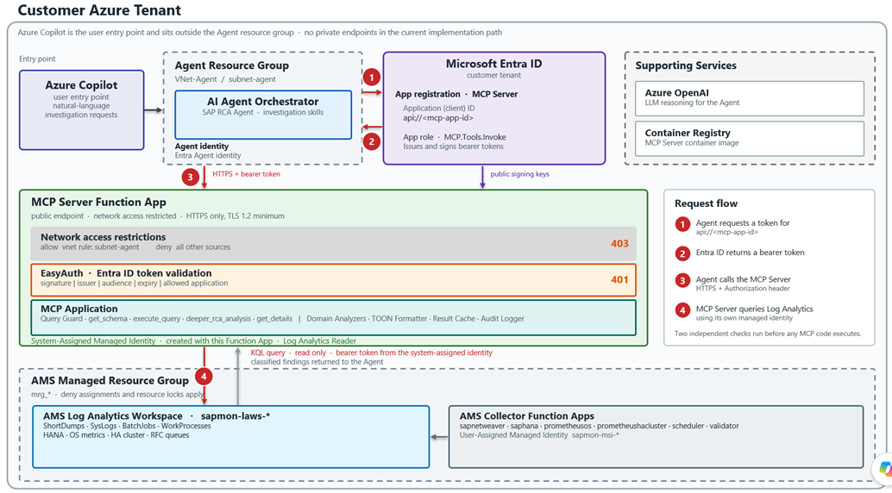
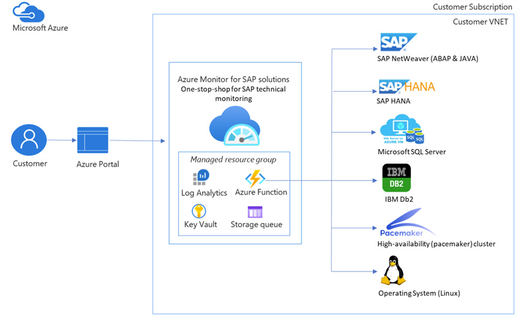
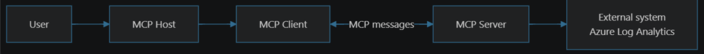
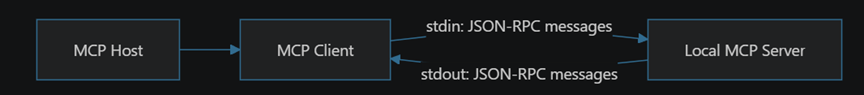

```python
# AMS SAP MCP Server: Deployment & Security High-Level Design
```

## Contents

- [1. Objective](#_Toc241064235)
- [2. Architecture Overview](#_Toc241064236)
  - [2.1 Overall Architecture Diagram](#_Toc241064237)
  - [2.2 Component Summary](#_Toc241064238)
- [3. Authentication](#_Toc241064239)
  - [3.1 Agent → MCP Server (Entra ID App Registration)](#_Toc241064240)
    - [3.1.1 What the App Registration Is and Why It Is Needed](#_Toc241064241)
    - [3.1.2 What EasyAuth Does With It](#_Toc241064242)
    - [3.1.3 End-to-End Token Flow](#_Toc241064243)
    - [3.1.4 Setup Summary](#_Toc241064244)
  - [3.2 MCP Server → Log Analytics Workspace (System-Assigned Managed Identity)](#_Toc241064245)
  - [3.3 Credential Chain & Resolution](#_Toc241064246)
  - [3.4 SID-to-Workspace Mapping](#_Toc241064247)
  - [3.4 Open items for implementation](#_Toc241064248)
- [4. Network Security](#_Toc241064249)
  - [4.1 Current AMS Network Posture (Verified Baseline)](#_Toc241064250)
  - [4.2 Target Topology — MCP in the Managed RG, Agent in a Separate VNet](#_Toc241064251)
  - [4.3 Function App Network Model — Inbound versus Outbound](#_Toc241064252)
  - [4.4 Public Endpoint with Restricted Network Access](#_Toc241064253)
    - [4.4.1 How the Restriction Is Enforced](#_Toc241064254)
    - [4.4.2 Role of Virtual Network Peering](#_Toc241064255)
  - [4.5 Layered Controls on the MCP Function App](#_Toc241064256)
  - [4.6 Outbound Path — MCP Server to Log Analytics](#_Toc241064257)
  - [4.7 DNS Considerations](#_Toc241064258)
  - [4.8 Future State — If Private Endpoints Are Enabled](#_Toc241064259)
  - [4.9 Open Items and Dependencies](#_Toc241064260)
  - [4.10 Open items for implementation](#_Toc241064261)
- [5. Deployment Strategy](#_Toc241064262)
  - [5.1 Azure Container Apps (Current in POC)](#_Toc241064263)
  - [5.2 Azure Function App — AMS-Aligned Deployment (Implemented as POC)](#_Toc241064264)
    - [5.2.1 Why Function App — Alignment with AMS](#_Toc241064265)
    - [5.2.2 Deployed Resource Topology](#_Toc241064266)
    - [5.2.3 ASGI Adapter Design – not relevant with Azure function MCP extension](#_Toc241064267)
    - [5.2.4 Docker Image — Dockerfile.funcapp](#_Toc241064268)
    - [5.2.5 Deployment Sequence (10 Steps)](#_Toc241064269)
    - [5.2.6 Entra ID Authentication via EasyAuth](#_Toc241064270)
    - [5.2.7 Result Cache and Function App Hosting Plans](#_Toc241064271)
    - [Process longevity by hosting plan](#_Toc241064272)
    - [Instance affinity when scaled beyond one instance](#_Toc241064273)
    - [Decision](#_Toc241064274)
    - [5.2.8 Deployment Options — Pros & Cons](#_Toc241064275)
    - [5.2.9 End-to-End Flow — New vs Existing Customers](#_Toc241064276)
    - [5.2.10 Current Status & Open Items](#_Toc241064277)
  - [5.3 Comparison: Container Apps vs Function App](#_Toc241064278)
  - [5.4 Docker Image Structure](#_Toc241064279)
  - [5.5 Open items for implementation](#_Toc241064280)
- [6. MCP Tools — Detailed Design](#_Toc241064281)
  - [6.1 Tool Inventory](#_Toc241064282)
  - [6.2 get_schema — Schema Discovery](#_Toc241064283)
  - [6.3 execute_query — Query Execution & Classification](#_Toc241064284)
  - [6.4 deeper_rca_analysis — Post-hoc Classification](#_Toc241064285)
  - [6.5 get_details — Progressive Disclosure](#_Toc241064286)
  - [6.6 MCP Tools Sub-Diagram](#_Toc241064287)
  - [6.7 Open items for implementation](#_Toc241064288)
- [7. Token-Optimized Implementation](#_Toc241064289)
  - [7.1 The Problem: Raw Rows vs. Structured Findings](#_Toc241064290)
  - [7.2 TOON Format (Tool Output Optimization Notation)](#_Toc241064291)
  - [7.3 Analyzer Pipeline](#_Toc241064292)
  - [7.4 Generic Summarizer](#_Toc241064293)
  - [7.5 Result Cache & Progressive Disclosure](#_Toc241064294)
  - [7.6 Token Optimization Sub-Diagram](#_Toc241064295)
  - [7.7 Open items for implementation](#_Toc241064296)
- [8. Skills & Domain Knowledge](#_Toc241064297)
  - [8.1 Where to Create Skills](#_Toc241064298)
    - [8.1.1 Agent-Side Skills for Known Issue Patterns](#_Toc241064299)
    - [8.1.2 How a Skill Reduces Turns](#_Toc241064300)
    - [8.1.3 Anatomy of a Skill](#_Toc241064301)
    - [8.1.4 Division of Responsibility](#_Toc241064302)
    - [8.1.5 Governance](#_Toc241064303)
  - [8.2 MCP Server Domain Knowledge Architecture](#_Toc241064304)
  - [8.3 Agent-Side Skills vs. MCP Server Skills](#_Toc241064305)
  - [8.4 Adding a New Domain / Skill](#_Toc241064306)
- [9. Security Controls Summary](#_Toc241064307)
- [10. Telemetry, Logging & Investigation Traceability](#_Toc241064308)
  - [10.1 Objectives](#_Toc241064309)
  - [10.2 Current State and Gap](#_Toc241064310)
  - [10.3 Correlation Model](#_Toc241064311)
  - [10.4 Event Schema](#_Toc241064312)
  - [10.5 Emission Points](#_Toc241064313)
  - [10.6 Telemetry Destination](#_Toc241064314)
  - [10.7 Example Operator Queries](#_Toc241064315)
  - [10.8 Data Protection in Telemetry](#_Toc241064316)
  - [10.9 Implementation Plan (Not Yet Scheduled)](#_Toc241064317)
  - [10.10 Open items for implementation](#_Toc241064318)
- [11. Appendix — Configuration Reference](#_Toc241064319)

<a id="_Toc241064235"></a>
# 1. Objective

The AMS SAP MCP Server is an enterprise-grade Model Context Protocol (MCP) server that provides SAP observability and root-cause-analysis capabilities to AI agents. It is deployed within the customer's Azure tenant alongside the AI Agent (orchestrator) and the required LLM (Azure OpenAI). All runtime components — the Agent, the MCP Server, the LLM, and the Log Analytics Workspaces — reside in the customer tenant.

This document provides the High-Level Design covering deployment topology, authentication flows, network security posture, the detailed design of each MCP tool, the token-optimized implementation approach, and the skills/domain knowledge architecture.

Key design principles:
- All runtime components deployed in the customer tenant (Agent, MCP Server, LLM, LAWS)
- Entra ID–based authentication for every inter-component call
- System-Assigned Managed Identity created on the MCP Server Function App — granted Log Analytics Reader on the AMS workspace; no stored credentials, no new privilege
- Identity-first network posture — Entra ID validation at the platform layer, with App Service Access Restrictions as defence in depth
- Read-only data access with KQL query guard
- Token-optimized responses — 80-90% token reduction via TOON format and domain classifiers
- Plugin-based analyzer architecture for extensibility

<a id="_Toc241064236"></a>
# 2. Architecture Overview

<a id="_Toc241064237"></a>
## 2.1 Overall Architecture Diagram

The following diagram shows the deployment topology. All components reside within the customer's Azure tenant. The AI Agent runs in its own resource group and virtual network; the MCP Server runs as a Function App alongside the AMS monitor resources. Access to the MCP Server is controlled by Entra ID authentication combined with Function App network access restrictions. Private Endpoints are not part of the current implementation path.



<a id="_Toc241064238"></a>
## 2.2 Component Summary

| **Component** | **Deployment Target** | **Tenant** | **Purpose** |
|---|---|---|---|
| **AI Agent Orchestrator** | Container App / App Service | Customer | Routes user queries to SAP RCA Agent; manages LLM interactions |
| **SAP RCA Agent** | Container App / App Service | Customer | Domain-specific agent that calls MCP tools |
| **AMS SAP MCP Server** | Function App (AMS-aligned) | Customer | MCP server exposing SAP observability tools; runs under its own System-Assigned Managed Identity |
| **Azure OpenAI (LLM)** | Azure OpenAI Service | Customer | GPT-xx for agent reasoning |
| **AMS LAWS** | Log Analytics Workspace | Customer | SAP telemetry written by AMS collectors; read by the MCP Server via System-Assigned Managed Identity (Log Analytics Reader) |
| **Azure Key Vault** | Key Vault | Customer | Secrets management (workspace IDs, config) |
| **Azure Container Registry** | ACR | Customer | MCP server container images |

<a id="_Toc241064239"></a>
# 3. Authentication

All inter-component authentication uses Microsoft Entra ID. No shared secrets or API keys are stored — credential flows are based on managed identities and OAuth 2.0 client credentials grants.

<a id="_Toc241064240"></a>
## 3.1 Agent → MCP Server (Entra ID App Registration)

The AI Agent authenticates to the MCP Server with an Entra ID token. This replaces the Function App master API key used by the existing AMS collector Function Apps. The mechanism has two halves: an app registration in Entra ID that represents the MCP Server as a protected resource, and EasyAuth on the Function App that validates incoming tokens against that app registration.

<a id="_Toc241064241"></a>
### 3.1.1 What the App Registration Is and Why It Is Needed

An Entra ID app registration is an identity object that represents an application to the directory. For the MCP Server it plays the role of a protected API. Without it there is no identifier that a caller can request a token for, and no definition of what a valid token for the MCP Server looks like.

Concretely, the app registration provides four things:

| **Element** | **What it is** | **Why the MCP Server needs it** |
|---|---|---|
| **Application (client) ID** | A GUID that uniquely identifies the MCP Server in the directory | EasyAuth uses it to know which application incoming tokens must be addressed to |
| **Application ID URI (api://<app-id>)** | The audience identifier for the protected API | The Agent requests a token for this value; it becomes the aud claim in the token |
| **App roles (for example MCP.Tools.Invoke)** | Permissions that can be granted to calling applications | Allows authorisation beyond authentication — which applications may invoke MCP tools |
| **Service principal** | The tenant-local instance of the application | The object against which role assignments and sign-in audit records are recorded |

Without an app registration the only alternatives are a shared secret such as a Function App key, which is what AMS uses today for the collectors, or anonymous access. The app registration is what makes it possible to say the caller is this specific application in this specific tenant, and to prove it cryptographically rather than by possession of a shared string.

<a id="_Toc241064242"></a>
### 3.1.2 What EasyAuth Does With It

Enabling the Entra ID identity provider on the Function App configures EasyAuth to trust the app registration. EasyAuth is a platform module that runs in the App Service front end, ahead of the Functions host and the MCP application. On every request it performs the following checks and rejects the request with HTTP 401 if any check fails.

| **Check** | **Claim or property** | **Validation performed** |
|---|---|---|
| **Token present** | Authorization header | A bearer token must be supplied |
| **Signature** | Token signature | Verified against the Entra ID published signing keys for the tenant |
| **Issuer** | iss | Must match the configured tenant issuer URL |
| **Audience** | aud | Must match the MCP application ID or its api:// identifier URI |
| **Expiry** | exp / nbf | The token must be currently valid |
| **Caller identity** | appid / azp | Optionally restricted to an allow-list of client application IDs |
| **Authorisation** | roles | Optionally required to contain an app role such as MCP.Tools.Invoke |

Two points are worth emphasising for review. First, no authentication code exists in the MCP application; the control is entirely at the platform layer and cannot be bypassed by an application defect. Second, no client secret is required on the Function App side, because validating a token only requires the public signing keys, which EasyAuth fetches from Entra ID automatically.

<a id="_Toc241064243"></a>
### 3.1.3 End-to-End Token Flow

```text
+----------------------+                      +------------------------------+
  |  AI Agent            |  1. Request token    |  Microsoft Entra ID          |
  |  identity:           | -------------------\> |  (customer tenant)           |
  |   managed identity   |     client creds     |                              |
  |   or service         |     scope:           |  App registration:           |
  |   principal          |     api://\<mcp-app\>  |   MCP Server                 |
  |                      | \<------------------- |   - Application (client) ID  |
  |                      |  2. Bearer token     |   - api://\<app-id\>           |
  +----------+-----------+     aud = MCP app    |   - App role: MCP.Tools.Invoke|
             |                                  +------------------------------+
             | 3. HTTPS request                                  ^
             |    Authorization: Bearer \<token\>                  |
             v                                                   | EasyAuth fetches
  +---------------------------------------------+               | public signing keys
  |  MCP Server Function App                    |---------------+
  |                                             |
  |  +---------------------------------------+  |
  |  | Network access restrictions           |  |  reject -\> 403
  |  | allow Agent subnet, deny all others   |  |
  |  +------------------+--------------------+  |
  |                     |                       |
  |  +------------------v--------------------+  |
  |  | EasyAuth (platform layer)             |  |  reject -\> 401
  |  |  signature | iss | aud | exp | roles  |  |
  |  +------------------+--------------------+  |
  |                     |  valid token          |
  |  +------------------v--------------------+  |
  |  | Functions host -\> AsgiFunctionApp     |  |
  |  |            -\> MCP application         |  |
  |  +---------------------------------------+  |
  +---------------------------------------------+

  4. The MCP Server then queries Log Analytics using its own
```
     System-Assigned Managed Identity - a separate identity from the caller.

Note the separation of the two identities. The Agent identity is used only to prove who is calling the MCP Server. The MCP Server's own System-Assigned Managed Identity is used to read Log Analytics. The Agent never obtains, and never needs, access to the workspace.

<a id="_Toc241064244"></a>
### 3.1.4 Setup Summary

| **Step** | **Where** | **Action** |
|---|---|---|
| **1** | Entra ID | Register the MCP Server application (single tenant) |
| **2** | Entra ID | Set the Application ID URI to api://<application-id> |
| **3** | Entra ID | Define the app role MCP.Tools.Invoke with allowed member type Applications |
| **4** | Function App | Add the Microsoft identity provider, referencing the app registration |
| **5** | Function App | Set restrict access to Require authentication and unauthenticated requests to HTTP 401 |
| **6** | Entra ID | Grant the Agent's identity the MCP.Tools.Invoke app role on the MCP application |
| **7** | Agent | Configure the Agent to request a token for api://<application-id> and send it as a bearer token |

Steps 1 to 5 have been completed on the deployed Function App. Steps 6 and 7 depend on the Agent's identity being confirmed and are tracked as open items in section 4.9.

<a id="_Toc241064245"></a>
## 3.2 MCP Server → Log Analytics Workspace (System-Assigned Managed Identity)

A System-Assigned Managed Identity is created on the MCP Server Function App as part of its deployment. That identity is granted the Log Analytics Reader role on the AMS Log Analytics Workspace. No credentials are stored in the application, the container image, or the app settings — the Azure SDK acquires tokens from the platform identity endpoint at runtime.

A system-assigned identity was chosen in preference to reusing the AMS user-assigned identity (sapmon-msi-\*) that the collector Function Apps share. The reasons are:
- Lifecycle binding — the identity is created with the Function App and deleted automatically with it, leaving no orphaned principal
- Blast radius — the MCP Server holds only Log Analytics Reader, whereas the shared AMS identity additionally holds storage, queue, table and Key Vault permissions that the MCP Server does not require
- Least privilege — read-only access to one workspace is the complete permission set for this component
- Attribution — Log Analytics query audit records attribute activity to the MCP Server specifically rather than to a principal shared with six collector apps
- Blast-radius isolation — revoking or investigating MCP Server access does not affect telemetry collection by the AMS collectors
- Simplicity — no client ID needs to be supplied in configuration, because a system-assigned identity is unambiguous

The trade-off is that a role assignment must be created at deployment time, whereas reusing the AMS identity would have inherited an existing assignment. This is handled by the deployment script and is a one-time operation per Function App.

| **Aspect** | **System-Assigned (selected)** | **Reuse AMS User-Assigned (alternative)** |
|---|---|---|
| **Created by** | The Function App deployment | The AMS monitor provisioning |
| **Lifecycle** | Bound to the Function App; deleted with it | Independent; outlives the Function App |
| **Permissions held** | Log Analytics Reader only | Storage, Queue, Table, Key Vault, plus workspace access |
| **Role assignment needed** | Yes — created at deployment | No — already present |
| **Audit attribution** | Specific to the MCP Server | Shared with all AMS collectors |
| **Configuration required** | None — identity is implicit | AZURE_CLIENT_ID must name the identity |
| **Revocation impact** | Affects the MCP Server only | Would affect AMS collectors |

```text
+------------------------------------+   +----------------------+   +-----------------------+
  |  MCP Server Function App           |   |  Entra ID            |   |  AMS Log Analytics    |
  |                                    |   |  MSI token endpoint  |   |  Workspace            |
  |  Identity:                         |   |                      |   |  sapmon-laws-\*        |
  |  System-Assigned Managed Identity  |-1-\> resource:            |   |                       |
  |  (created with this Function App)  |   |  https://api.        |   |                       |
  |                                    |   |  loganalytics.io     |   |                       |
  |  DefaultAzureCredential            | \<-2- access token        |   |                       |
  |   -\> ManagedIdentityCredential     |   +----------------------+   |                       |
  |                                    |                             |  RBAC on this scope:  |
  |  LogsQueryClient                   |---3- KQL query, read only --\>|  Log Analytics Reader |
  |                                    | \<-4- result rows -----------|  held by the MCP       |
  |                                    |                             |  system-assigned MI    |
  +------------------------------------+                             +-----------------------+

  Separate identity, same workspace:
  AMS collector Function Apps  --- write SAP telemetry ---\>  the same workspace
```
  using the AMS User-Assigned Managed Identity (sapmon-msi-\*)

Role assignment required by the MCP Server:

| **Principal** | **Role** | **Scope** | **Purpose** | **Created by** |
|---|---|---|---|---|
| **MCP Function App system-assigned MI** | Log Analytics Reader | AMS Log Analytics Workspace | Execute read-only KQL queries | MCP Server deployment |

Least privilege is enforced twice. Log Analytics Reader grants read access only at the Azure RBAC layer, and the MCP Server additionally applies a read-only KQL guard in application code, so management commands and write operations are rejected before a query is sent to Azure Monitor (see section 6.3).

<a id="_Toc241064246"></a>
## 3.3 Credential Chain & Resolution

The MCP Server uses a priority-based credential chain (implemented in la_client.py). The first available credential wins:

| **Priority** | **Credential Source** | **Use Case** | **Notes** |
|---|---|---|---|
| **1** | AZURE_BEARER_TOKEN (env var) | Local development only | Short-lived (~1h); wrapped in StaticTokenCredential; never set in Azure deployments |
| **2** | DefaultAzureCredential | Function App and Container App deployments | Resolves to ManagedIdentityCredential — the Function App system-assigned identity |

In deployed environments AZURE_BEARER_TOKEN is unset, so DefaultAzureCredential resolves to the system-assigned managed identity automatically. Because the identity is system-assigned there is exactly one managed identity on the resource, so no AZURE_CLIENT_ID value is required to disambiguate. There is no code path in a deployed environment that uses a secret, key, or password to reach Log Analytics.

<a id="_Toc241064247"></a>
## 3.4 SID-to-Workspace Mapping

Multi-system environments map SAP SIDs to different Log Analytics Workspaces. The resolution order is:

1. Explicit workspace_id parameter in the tool call (highest priority)

2. SID_WORKSPACE_MAP lookup (e.g. SID_WORKSPACE_MAP=CHA:guid1,PRD:guid2)

3. Default AZURE_LOG_ANALYTICS_WORKSPACE_ID from environment

<a id="_Toc241064248"></a>
## 3.4 Open items for implementation

1.       Agent to function app communication via Agent Identity with Entra has been tested, But if there is a difference in Azure function app MCP extension for this flow – pls check on this in LLD – **Ignite scope**

2.       The OBO flow from Agent identity to all the way LA is not implemented right now – check this **beyond ignite scope**

<a id="_Toc241064249"></a>
# 4. Network Security

This section describes the network design for the target topology, in which the MCP Server runs as a Function App inside the AMS managed resource group alongside the AMS Log Analytics Workspace, while the AI Agent runs in a separate resource group, virtual network, and subnet within the same customer tenant.

Important: the design below reflects the current AMS network posture, in which Private Endpoints are not enabled on any AMS resource. Section 4.8 describes what changes if Private Endpoints are introduced later.

<a id="_Toc241064250"></a>
## 4.1 Current AMS Network Posture (Verified Baseline)

The following was verified against a live AMS monitor deployment. It is the factual starting point for the MCP Server network design.

| **Aspect** | **Observed State** | **Implication for the MCP Server** |
|---|---|---|
| **Private Endpoints in the managed resource group** | None present | No private DNS zones or private IP paths exist to reuse |
| **Log Analytics Workspace — public access for query** | Enabled | The MCP Server reaches Log Analytics over its public service endpoint |
| **Log Analytics Workspace — public access for ingestion** | Enabled | AMS collectors write over the public service endpoint |
| **Azure Monitor Private Link Scope** | Not configured | No AMPLS constraints to honour today |
| **Collector Function App — inbound public access** | Enabled | The MCP Function App inherits the same inbound model |
| **Collector Function App — IP access restrictions** | Allow all (Any) | Inbound is not restricted by network rules today |
| **Collector Function App — VNet integration** | Enabled (outbound) | Outbound traffic is routed through the AMS subnet |
| **Collector Function App — route all outbound** | Enabled | All outbound traffic, including internet-bound, traverses the subnet |
| **Collector Function App — authentication** | Function App master API keys | Network is not the primary control; identity is |

The key observation is that AMS today does not rely on network isolation as its primary access control for the provider Function Apps. Inbound endpoints are public and unrestricted at the network layer; access is controlled by the Function App key that only the AMS Resource Provider holds. The MCP Server improves on this by replacing the shared key with Entra ID identity validation, and can optionally add network restrictions on top.

<a id="_Toc241064251"></a>
## 4.2 Target Topology — MCP in the Managed RG, Agent in a Separate VNet

```text
┌═══════════════════════════ Customer Azure Tenant ═══════════════════════════════════┐
║                                                                                     ║
║  ┌──────── Agent Resource Group ────────┐      ┌──── AMS Managed Resource Group ───┐║
║  │  VNet-Agent   (e.g. 10.20.0.0/16)    │      │  (mrg_*) — deny assignments apply │║
║  │                                      │      │                                   │║
║  │  ┌────────────────────────────────┐  │      │  VNet-AMS  (e.g. 10.10.0.0/16)    │║
║  │  │ subnet-agent (10.20.1.0/24)    │  │      │  ┌─────────────────────────────┐  │║
║  │  │  ┌──────────────────────────┐  │  │      │  │ subnet-ams (10.10.1.0/24)   │  │║
║  │  │  │  AI Agent Orchestrator   │  │  │      │  │  (delegated to Microsoft.Web)│ │║
║  │  │  │  (Container App /        │  │  │      │  │                             │  │║
║  │  │  │   App Service /          │  │  │      │  │  VNet integration (outbound)│  │║
║  │  │  │   Foundry Agent)         │  │  │      │  │   ├─ MCP Function App       │  │║
║  │  │  └────────────┬─────────────┘  │  │      │  │   ├─ sapnetweaver provider  │  │║
║  │  └───────────────┼────────────────┘  │      │  │   ├─ saphana provider       │  │║
║  └──────────────────┼───────────────────┘      │  │   ├─ prometheus providers   │  │║
║                     │                          │  │   └─ scheduler / validator  │  │║
║                     │                          │  └─────────────────────────────┘  │║
║                     │                          │                                   │║
║                     │                          │  ┌─────────────────────────────┐  │║
║                     │                          │  │ AMS Log Analytics Workspace │  │║
║                     │                          │  │ sapmon-laws-*               │  │║
║                     │                          │  │ public query endpoint       │  │║
║                     │                          │  └──────────────▲──────────────┘  │║
║                     │                          └─────────────────┼─────────────────┘║
║                     │                                            │                  ║
║                     │  (1) Agent → MCP Server                    │ (2) MCP → LAWS   ║
║                     │      HTTPS to the App Service              │     HTTPS via    ║
║                     │      front end + Entra ID token            │     AMS MSI      ║
║                     ▼                                            │                  ║
║        ┌────────────────────────────────────┐                    │                  ║
║        │  App Service Front End (regional,  │────────────────────┘                  ║
║        │  multi-tenant, PUBLIC endpoint)    │                                       ║
║        │  <mcp-app>.azurewebsites.net       │                                       ║
║        │  ┌──────────────────────────────┐  │   NOTE: this front end is NOT         ║
║        │  │ EasyAuth — Entra ID          │  │   inside either VNet. VNet            ║
║        │  │ Access Restrictions (opt.)   │  │   integration affects OUTBOUND only.  ║
║        │  └──────────────────────────────┘  │                                       ║
║        └────────────────────────────────────┘                                       ║
╚═════════════════════════════════════════════════════════════════════════════════════╝
```

<a id="_Toc241064252"></a>
## 4.3 Function App Network Model — Inbound versus Outbound

Understanding the Azure Functions network model is essential because inbound and outbound traffic use entirely different paths.

| **Direction** | **Mechanism** | **Where the traffic terminates** | **Controlled by** |
|---|---|---|---|
| **Inbound (Agent → MCP Server)** | App Service front end | Microsoft-managed regional front end — NOT an address inside the VNet | EasyAuth, Access Restrictions, or a Private Endpoint |
| **Outbound (MCP Server → Log Analytics)** | Regional VNet integration | Injected into the delegated subnet in the AMS VNet | Subnet routing, NSG, UDR, firewall or NAT gateway |

This distinction is the single most important point in this section. Regional VNet integration gives the Function App an outbound presence in the subnet. It does not place the inbound endpoint in the VNet, and it does not create a private inbound IP address. The site continues to be reachable at its public azurewebsites.net hostname unless an additional control is applied.

<a id="_Toc241064253"></a>
## 4.4 Public Endpoint with Restricted Network Access

(for cases not OK with function public access for inbound calls)

The network approach is that all AMS function app  resources remain on public access, consistent with the current AMS posture, and the MCP Server Function App is protected by network access restrictions that permit only the virtual network hosting the AI Agent. The Agent virtual network is peered with the AMS virtual network.

This section records precisely how that is implemented, because the Azure Functions inbound model has an important characteristic that determines which control actually enforces the restriction.

<a id="_Toc241064254"></a>
### 4.4.1 How the Restriction Is Enforced

Function App network access restrictions are applied to the App Service front end, not to the virtual network. A rule of type virtual network names a specific subnet and is enforced using a Microsoft.Web service endpoint configured on that subnet. When a request arrives, the platform identifies the originating subnet and matches it against the rule list.

| **Requirement** | **Where it is configured** | **Why it is required** |
|---|---|---|
| **Microsoft.Web service endpoint on the Agent subnet** | Agent virtual network | Allows the platform to identify the originating subnet of the request |
| **Allow rule naming the Agent subnet** | MCP Function App access restrictions | Permits traffic from that subnet |
| **Deny all rule after the allow rules** | MCP Function App access restrictions | Rejects every other source, including the public internet |
| **Same restrictions on the SCM/Kudu site** | MCP Function App access restrictions | Prevents the deployment endpoint being used to bypass the main site |
| **EasyAuth requiring authentication** | MCP Function App authentication | Identity control that operates independently of the network rules |

An important detail for implementation: the allow rule must name the Agent subnet itself. Virtual network peering does not cause traffic from the Agent subnet to be seen as originating from the AMS subnet, so naming only the AMS subnet would not admit the Agent. Each subnet that must reach the MCP Server is listed explicitly.

<a id="_Toc241064255"></a>
### 4.4.2 Role of Virtual Network Peering

Peering between the Agent virtual network and the AMS virtual network is recommended, but it is worth being precise about what it does and does not do in this design.

| **Question** | **Answer in the current design** |
|---|---|
| **Does peering carry the Agent to MCP Server request?** | No. The Function App inbound endpoint is served by the App Service front end and has no private IP in either virtual network, so the request does not traverse the peering link. |
| **Does peering enforce the access restriction?** | No. The restriction is enforced by the access restriction rule plus the Microsoft.Web service endpoint on the Agent subnet. |
| **Is peering still useful?** | Yes. It provides private connectivity for any other traffic between the Agent and AMS estates, and it is a prerequisite if Private Endpoints are introduced later. |
| **Is peering sufficient on its own?** | No. Without the access restriction rules the Function App would remain reachable from any source on the internet. |
| **What happens if Private Endpoints are added later?** | Peering becomes load-bearing for the Agent to MCP path, and private DNS zone linkage to both virtual networks also becomes mandatory. |

**In summary, the clarification for the design record is that the enforcing control is the access restriction rule combined with the service endpoint on the Agent subnet, with peering providing the broader private connectivity and the foundation for a future Private Endpoint model.**

<a id="_Toc241064256"></a>
## 4.5 Layered Controls on the MCP Function App

Access to the MCP Server is controlled in two independent layers. A request must pass both before any MCP application code executes. Neither layer depends on the other, so a misconfiguration in one does not silently remove all protection.

| **Layer** | **Control** | **Rejects with** | **Status** |
|---|---|---|---|
| **Network** | Access restriction — allow the Agent subnet | HTTP 403 | To be applied |
| **Network** | Access restriction — deny all other sources | HTTP 403 | To be applied |
| **Network** | Same restrictions applied to the SCM site | HTTP 403 | To be applied |
| **Identity** | EasyAuth — require authentication | HTTP 401 | Implemented |
| **Identity** | EasyAuth — validate issuer, audience and expiry | HTTP 401 | Implemented |
| **Identity** | Restrict to the Agent Identity ID or app role | HTTP 403 | Recommended |
| **Transport** | HTTPS only, TLS 1.2 minimum, FTPS disabled | Connection refused | Implemented |
| **Data** | Read-only KQL guard and automatic row cap | Tool error | Implemented |

```text
Agent subnet  (VNet-Agent, peered with VNet-AMS (peering not mandatory for now))
  service endpoint: Microsoft.Web
  -----------------------------------
```text
              |
              |  HTTPS + Entra ID bearer token
              v
  +-------------------------------------------------+
  |  MCP Server Function App front end              |
  |                                                 |
  |  +-------------------------------------------+  |
  |  | Access restrictions                       |  |
  |  |  100  Allow  vnet rule: subnet-agent      |  |
  |  |  200  Allow  vnet rule: subnet-ams (opt)  |  |
  |  |  max  Deny   Any                          |  |
  |  +---------------------+---------------------+  |
  |                        | passed network check   |
  |  +---------------------v---------------------+  |
  |  | EasyAuth - authentication  (enforced)     |  |
  |  |  signature | issuer | audience | expiry   |  |
```

| +---------------------+---------------------+ |
| | EasyAuth - authorization (NOT YET SET) | |

  | | allowed client application ID            | |

  | or required app role MCP.Tools. Invoke       | |

```text
  | +---------------------+---------------------+ |
  |                        | passed identity check |
  |  +---------------------v---------------------+ |
  |  | Functions host -> MCP application         | |
  |  +-------------------------------------------+ |
  +-------------------------------------------------+
```

  Any source other than the listed subnets is rejected at the network layer.
```
  Any request without a valid Entra ID token is rejected at the identity layer.

<a id="_Toc241064257"></a>
## 4.6 Outbound Path — MCP Server to Log Analytics

The MCP Server queries the AMS Log Analytics Workspace over the Azure Monitor query endpoint. Because the workspace has public query access enabled and no Private Endpoint, this is a service endpoint call authenticated by the AMS Managed Identity.

| **Element** | **Value or behaviour** | **Note** |
|---|---|---|
| **Source** | MCP Function App, regional VNet integration | Outbound traffic is injected into the AMS delegated subnet |
| **Route all outbound** | Enabled, consistent with AMS collectors | All outbound traffic traverses the subnet and is subject to NSG and UDR |
| **Destination** | Azure Monitor query endpoint (api.loganalytics.io) | Public service endpoint — no Private Endpoint exists today |
| **Egress requirement** | The AMS subnet must retain outbound access to Azure Monitor | Already satisfied — AMS collectors use the same path to write telemetry |
| **Authentication** | MCP Function App System-Assigned Managed Identity | Log Analytics Reader on the workspace |
| **Recommended NSG rule** | Allow outbound 443 to the AzureMonitor service tag | Service tags avoid hard-coded IP ranges and are maintained by Microsoft |

Because route-all is enabled, any restrictive NSG or user-defined route applied to the AMS subnet affects the MCP Server exactly as it affects the existing AMS collectors. If a deny-by-default egress policy is introduced, the AzureMonitor, AzureActiveDirectory, and container registry service tags must be allowed or the collectors will fail alongside the MCP Server. This shared fate is intentional — it keeps the MCP Server operationally consistent with the rest of the monitor.

<a id="_Toc241064258"></a>
## 4.7 DNS Considerations

| **Scenario** | **DNS requirement** | **Action needed** |
|---|---|---|
| **Current state — no Private Endpoints** | Standard Azure public DNS resolution | None — no private DNS zones are involved |
| **Future — Private Endpoint on the MCP Function App** | privatelink.azurewebsites.net | Link the private DNS zone to both the AMS VNet and the Agent VNet |
| **Future — Private Endpoint on Log Analytics** | privatelink.monitor.azure.com and the associated Azure Monitor zones | Link to the AMS VNet; required for the MCP Server and all AMS collectors |
| **Custom DNS servers in either VNet** | Conditional forwarders to Azure-provided DNS | Required before any Private Endpoint resolution will work |

A frequent failure mode when Private Endpoints are introduced is correct routing with incorrect name resolution. The caller resolves the public address, bypasses the Private Endpoint, and is then blocked by the public access setting. Private DNS zone linkage to every calling virtual network is mandatory, not optional.

<a id="_Toc241064259"></a>
## 4.8 Future State — If Private Endpoints Are Enabled

Private Endpoints are not enabled on any AMS resource today. Introducing them is an AMS platform decision rather than an MCP Server decision, because the managed resource group carries deny assignments that prevent the customer from adding endpoints to AMS resources directly. The considerations below are recorded so the MCP Server design remains compatible with that future.

| **Resource** | **Private Endpoint sub-resource** | **Consequence** | **Blast radius** |
|---|---|---|---|
| **MCP Function App** | sites | Inbound becomes a private IP in the AMS VNet; peering and private DNS from the Agent VNet become mandatory | Limited to the MCP Server |
| **Log Analytics Workspace** | Azure Monitor Private Link Scope | Query and ingestion may be restricted to private paths | Affects every AMS collector and every existing query consumer |
| **Storage account** | blob, queue, table, file | Functions runtime traffic moves to private paths | Affects the Functions host for all provider apps |
| **Key Vault** | vault | Secret retrieval moves to a private path | Affects AMS platform components |
| **Container Registry** | registry | Image pull moves to a private path | Affects deployment and restart of all provider apps |

The Azure Monitor Private Link Scope warrants particular caution. It is a scope-level construct: switching a workspace to private-only query or ingestion affects every client of that workspace, not only the MCP Server. If AMS adopts it, the AMS collectors, any customer dashboards, workbooks, alert rules, and external query tooling must all have a private path or an explicit exception. This is the principal reason the current AMS posture keeps public access enabled.

Recommended sequencing if Private Endpoints are adopted:
- 1. Enable the Private Endpoint and private DNS for the MCP Function App first — smallest blast radius, and it is the component exposed to the Agent
- 2. Establish VNet peering between the Agent VNet and the AMS VNet, and link the private DNS zone to both virtual networks
- 3. Validate the Agent-to-MCP path end to end before changing anything on the workspace
- 4. Introduce the Azure Monitor Private Link Scope only after every workspace consumer has been inventoried and given a private path or an exception
- 5. Keep public access enabled during transition and disable it only after private paths are proven

<a id="_Toc241064260"></a>
## 4.9 Open Items and Dependencies

| **Item** | **Owner** | **Decision required** |
|---|---|---|
| **Restrict EasyAuth to specific client application IDs** | MCP Server / Agent team | Confirm the Agent service principal object and application ID to allow |
| **Apply App Service Access Restrictions for the Agent subnet** | MCP Server team | Confirm the Agent subnet resource ID and enable the Microsoft.Web service endpoint on it |
| **Deploy the MCP Function App inside the managed resource group** | AMS service team | Requires AMS Resource Provider changes — see section 5.2.9 |
| **Adopt Private Endpoints for AMS resources** | AMS product and service teams | Platform-wide decision; blast radius assessment required, particularly for the workspace |
| **Egress policy on the AMS subnet** | AMS service team | If deny-by-default egress is introduced, allow the AzureMonitor, AzureActiveDirectory and registry service tags |
| **VNet peering between the Agent VNet and the AMS VNet** | Customer network team | Required only in the Private Endpoint future state, not in the current design |

Summary of the recommendation for the current state: rely on Entra ID EasyAuth as the primary control, restrict it to the Agent's application identity, and add App Service Access Restrictions naming the Agent subnet as defence in depth. Do not introduce VNet peering for the Agent-to-MCP path, because that path does not traverse the peering link while the inbound endpoint remains a public App Service front end.

**\**

<a id="_Toc241064261"></a>
## 4.10 Open items for implementation

**1.      ** Agent is right now not implemented within the network boundary – when this comes into scope then on function app to enable the restricted network access to enable between Subnet of AMS to the Agent Vnet/Subnet – need to be enabled for implementation **– beyond Ignite scope**

2.       In case of concerns from Customer’s on public access on the function app where the MCP server is deployed – then check more on how the restricted network access can be enabled from AMS subnet/service – **Ignite scope**

3.       **Current limitation** – we cannot support network boundaries right now for Ignite (check more on this with Shashank once based on customer experience on function app network restrictions) – appraise PM’s on this limitation

<a id="_Toc241064262"></a>
# 5. Deployment Strategy

<a id="_Toc241064263"></a>
## 5.1 Azure Container Apps (Current in POC)

The MCP Server is currently deployed as an Azure Container App. This is the validated deployment target with existing deployment scripts and CI/CD pipeline.

Deployment flow (deploy-to-aca-v2.ps1):
- 1. Reuse existing ACR (amsmcpserveracr) — push distinct image tag
- 2. Reuse existing Container Apps Environment (VNet-injected)
- 3. Create User-Assigned Managed Identity (UAMI)
- 4. Assign RBAC roles: Log Analytics Reader on LAWS, AcrPull on ACR
- 5. Deploy Container App with UAMI, internal ingress, port 8000
- 6. Configure environment variables (workspace ID, SID, timeouts, cache)

Container App configuration:

| **Parameter** | **Value** | **Notes** |
|---|---|---|
| **CPU** | 0.5 vCPU | Sufficient for KQL relay + classification |
| **Memory** | 1 Gi | In-memory result cache (50 entries, 5 min TTL) |
| **Min replicas** | 1 | Always-on for low-latency first call |
| **Max replicas** | 3 (configurable to 5) | Scale on concurrent requests |
| **Ingress** | Internal | No public FQDN; VNet-only access |
| **Target port** | 8000 | uvicorn streamable-http transport |
| **Registry auth** | Managed Identity (AcrPull) | No admin credentials |

Environment variables configured on the Container App:

| **Variable** | **Example Value** | **Purpose** |
|---|---|---|
| **AZURE_LOG_ANALYTICS_WORKSPACE_ID** | <workspace-guid> | Default LAWS workspace for queries |
| **AZURE_CLIENT_ID** | <UAMI-client-id> | User-Assigned Managed Identity client ID |
| **DEFAULT_SID** | CHA | Default SAP System ID |
| **MAX_QUERY_ROWS** | 1000 | Auto-cap for unbounded queries |
| **DEFAULT_TIMESPAN_HOURS** | 24 | Default time window when none specified |
| **QUERY_TIMEOUT_SECONDS** | 90 | KQL query timeout |
| **CACHE_TTL_SECONDS** | 300 | Result cache TTL (5 minutes) |
| **CACHE_MAX_ENTRIES** | 50 | Max cached query results |
| **SID_WORKSPACE_MAP** | CHA:guid1,PRD:guid2 | Multi-SID workspace routing |

<a id="_Toc241064264"></a>
## 5.2 Azure Function App — AMS-Aligned Deployment (Implemented as POC)

The MCP Server has been deployed as an Azure Function App to align with the existing Azure Monitor for SAP (AMS) deployment model. Every AMS monitor already provisions a set of provider Function Apps (SAP NetWeaver, SAP HANA, Prometheus OS, Prometheus HA Cluster, Scheduler, Validator). The MCP Server is deployed as an additional Function App using the same runtime, plan, identity, and network topology as those collectors.

<a id="_Toc241064265"></a>
### 5.2.1 Why Function App — Alignment with AMS

** **

**Current AMS Architecture**



Investigation of an existing AMS monitor confirmed that all AMS collector Function Apps are Linux Python containers, not .NET. The AMS service repository (Azure-WaaService) holds the C#/.NET Resource Provider that orchestrates deployment; the collectors themselves are Python container images published to an internal Azure Container Registry. This means the MCP Server — already written in Python — requires no language change or rewrite to fit the AMS model.

But since .NET gives lot of control – it’s a design choice – if MCP server needs to be implemented in .NET in function app – Decide on final approach with leads

Observed configuration of the existing AMS collector Function Apps:

| **Attribute** | **Observed Value** | **MCP Server Alignment** |
|---|---|---|
| **App kind** | functionapp,linux,container | Same — Linux container Function App |
| **Runtime image** | DOCKER|<internal-acr>/sapnetweaver-provider:4.0.x | Same pattern — DOCKER|<acr>/sap-rca-mcp-funcapp:latest |
| **Worker runtime** | python | Same — FUNCTIONS_WORKER_RUNTIME=python |
| **Functions version** | ~4 | Same — Azure Functions v4 |
| **App Service Plan** | Elastic Premium EP1 (shared by all providers) | Same plan reused — Dedicated plans are equally supported (see 5.2.7) |
| **Identity** | User-Assigned MI (sapmon-msi-*) | System-Assigned MI created on the MCP Function App — least privilege |
| **VNet** | VNet-integrated on the monitor subnet | Same VNet and subnet |
| **Authentication** | Function App master API keys | Changed to Entra ID (EasyAuth) — see 5.2.6 |

<a id="_Toc241064266"></a>
### 5.2.2 Deployed Resource Topology

For the POC the MCP Function App is deployed into the AMS-hosted resource group (where the Microsoft.Workloads/monitors resource lives) rather than the AMS managed resource group (mrg\_\*). The managed resource group carries deny assignments and CanNotDelete locks that permit resource creation only by the AMS Resource Provider service principal. Deploying inside the managed resource group is the productisation path and requires AMS service code changes (see 5.2.9).

```text
+--------------- AMS-Hosted Resource Group (POC target) ------------------------+
|                                                                               |
|   +----------------------------+     +-----------------------------------+    |
|   |  Microsoft.Workloads/      |     |  MCP Server Function App          |    |
|   |  monitors                  |     |  kind: functionapp,linux,container|    |
|   |  (AMS Monitor resource)    |     |  image: \<acr\>/sap-rca-mcp-funcapp |    |
|   +----------------------------+     |  auth : Entra ID EasyAuth         |    |
|                                      |                                   |    |
|   +----------------------------+     |  System-Assigned Managed Identity |    |
|   |  Function App Storage      |\<----+  created with this Function App   |    |
|   |  (Functions runtime state) |     +------+----------------------+-----+    |
|   +----------------------------+            |                      |          |
|                                    VNet     |                      | RBAC     |
|   +-------------------------------------+   |                      |          |
|   |  VNet: ams-\<monitor\>-vnet           |\<--+                      |          |
|   |  Subnet: \<monitor\>-subnet           |   (outbound integration) |          |
|   |  (shared with AMS collectors)       |                          |          |
|   +-------------------------------------+                          |          |
|                                                                    |          |
+--------------------------------------------------------------------|----------+
                                          reuses plan                |
+--------------- AMS Managed Resource Group (mrg\_\*) ------------------|----------+
|                 \[deny assignments + CanNotDelete\]                   |          |
|   +--------------------------+      +------------------------------+------+   |
|   |  App Service Plan        |      |  AMS User-Assigned Managed Identity  |   |
|   |  sapmon-app-\* (EP1/Dedicated)   |  sapmon-msi-\*                        |   |
|   |  shared by all providers |      |  used by the AMS collectors only     |   |
|   +--------------------------+      +------------------+-------------------+   |
|                                                        | writes telemetry      |
|   +----------------------------------------------------v-------------------+   |
|   |  AMS Log Analytics Workspace (sapmon-laws-\*)                           |   |
|   |  SAP telemetry: ShortDumps, SysLogs, BatchJobs, HANA, OS, HA Cluster   |   |
|   |                                                                        |   |
|   |  Role assignments on this scope:                                       |   |
|   |    - AMS UAMI (sapmon-msi-\*)          -\> write telemetry (collectors)  |   |
|   |    - MCP Function App system MI       -\> Log Analytics Reader (read)   |   |
|   +------------------------------------------------------------------------+   |
|                                                                                |
|   Existing AMS collector Function Apps (untouched):                            |
|   sapnetweaver-\*  saphana-\*  prometheusos-\*  prometheushacluster-\*             |
|   scheduler-\*     validator-\*                                                  |
+--------------------------------------------------------------------------------+

```
Resources created versus reused:

| **Resource** | **Created or Reused** | **Location** | **Notes** |
|---|---|---|---|
| **MCP Function App** | Created | AMS-hosted RG | sap-ams-mcp-funcapp |
| **Function App Storage Account** | Created | AMS-hosted RG | Required by the Functions runtime |
| **Container image** | Created | Azure Container Registry | sap-rca-mcp-funcapp:latest |
| **Entra ID App Registration** | Created | Entra ID tenant | Created via the Function App Authentication blade |
| **App Service Plan** | Reused | AMS managed RG | Shared with all AMS collectors — no new plan created; Elastic Premium or Dedicated |
| **System-Assigned Managed Identity** | Created | On the MCP Function App | Granted Log Analytics Reader on the AMS workspace |
| **VNet and subnet** | Reused | AMS-hosted RG | Same subnet as AMS collector Function Apps |
| **Log Analytics Workspace** | Reused | AMS managed RG | sapmon-laws-* — SAP telemetry source |
| **RBAC: Log Analytics Reader** | Reused | LAWS scope | Already present on the AMS UAMI |

<a id="_Toc241064267"></a>
### 5.2.3 ASGI Adapter Design – not relevant with Azure function MCP extension

Note - The below proposal is for FAST MCP implementation POC – this section is obsolete now for implementation of MCP server via Azure Function app extension

The MCP Server exposes an ASGI application (mcp.streamable_http_app()). On Container Apps this ASGI app is served by uvicorn. On Azure Functions the ASGI app is served by the Azure Functions host through the AsgiFunctionApp adapter. The adapter replaces uvicorn as the HTTP front door; the MCP server, tools, analyzers, schemas, and domain knowledge modules are byte-for-byte identical between the two deployment targets.

```text
Container App deployment                    Function App deployment
────────────────────────                    ───────────────────────
  ┌──────────────────┐                        ┌──────────────────────┐
  │  uvicorn         │                        │  Azure Functions     │
  │  (ASGI server)   │                        │  Host (v4 runtime)   │
  └────────┬─────────┘                        └──────────┬───────────┘
           │                                             │
           │                                  ┌──────────▼───────────┐
           │                                  │  AsgiFunctionApp     │
           │                                  │  (function_app.py)   │
           │                                  └──────────┬───────────┘
           │                                             │
           ▼                                             ▼
  ┌─────────────────────────────────────────────────────────────────┐
  │            mcp.streamable_http_app()   ← IDENTICAL              │
  │  ┌───────────────────────────────────────────────────────────┐  │
  │  │  server.py   config.py   la_client.py   schema_registry   │  │
  │  │  tools/      analyzers/  schemas/       domain_knowledge  │  │
  │  │            ← ZERO CODE CHANGES →                          │  │
  │  └───────────────────────────────────────────────────────────┘  │
  └─────────────────────────────────────────────────────────────────┘
```

The complete Function App entry point (function_app.py):

```python
import azure.functions as func
from server import mcp
# ANONYMOUS because Entra ID EasyAuth validates tokens at the platform layer,
# before the request ever reaches the Functions host or the MCP application.
app = func.AsgiFunctionApp(
    asgi_app=mcp.streamable_http_app(),
    http_auth_level=func.AuthLevel.ANONYMOUS,
)
```

The host.json sets an empty HTTP route prefix so that MCP protocol paths are served at the site root rather than under the default /api/ prefix:

```json
{
  "version": "2.0",
  "extensionBundle": {
    "id": "Microsoft.Azure.Functions.ExtensionBundle",
    "version": "[4.*, 5.0.0)"
  },
  "extensions": {
    "http": { "routePrefix": "" }
  }
}
```

Transport — HTTPS externally, HTTP inside the platform boundary. External callers always reach the MCP Server over HTTPS: the Function App is configured with HTTPS-only enabled and a minimum TLS version of 1.2, so plain HTTP requests are refused. TLS is terminated at the App Service front end, which then forwards the request to the Functions host and on to the ASGI application over plain HTTP inside the sandbox. The ASGI application never observes the TLS connection directly.

```text
Agent ---- HTTPS / 443 ----> App Service front end ---- HTTP ----> Functions host
                               (TLS terminates here)                      |
                                                                          | ASGI
                                                                          v
                                                              mcp.streamable_http_app()
```

- External hop: HTTPS, TLS 1.2 minimum, enforced by `httpsOnly`
- Internal hop: HTTP, inside the App Service sandbox boundary

This is not a weakening of the transport posture. It is the same model as the Container App deployment, where the Container Apps ingress terminates TLS and forwards to uvicorn over HTTP on port 8000. In both cases the unencrypted hop is internal to the platform.

| **Hop** | **Container App** | **Function App** |
|---|---|---|
| **Caller to ingress or front end** | HTTPS, TLS terminated at the ACA ingress | HTTPS, TLS terminated at the App Service front end |
| **Ingress or front end to application** | HTTP to uvicorn on port 8000 | HTTP to the Functions host, then ASGI |
| **Scheme seen by the ASGI application** | http, corrected by uvicorn proxy headers | Determined by the AsgiFunctionApp adapter |

Scheme and host propagation is the one behavioural difference worth recording. **Because TLS terminates upstream, the ASGI application must be told that the original request was HTTPS and which host the caller addressed. If that information is not propagated correctly, the application can construct incorrect absolute URLs or reject the request during host and origin validation.**

In the Container App deployment this is handled explicitly in run_server.py, where uvicorn is started with proxy header trust enabled to honour the ingress forwarded headers. That setting was added to resolve an Invalid Host header rejection observed when connecting from an agent runtime. The MCP server additionally disables DNS rebinding protection in its transport security settings for the same class of reason.

```python
# Container App — run_server.py
uvicorn.run(app, host="0.0.0.0", port=8000,
            proxy_headers=True, forwarded_allow_ips="*")
# MCP server — server.py
mcp = FastMCP(
    name="sap-rca-server",
    transport_security=TransportSecuritySettings(
        enable_dns_rebinding_protection=False),
    ...
)
```

On the Function App there is no uvicorn, so those settings have no equivalent. The AsgiFunctionApp adapter constructs the ASGI scope itself, and the scheme and host values it populates are determined by the adapter rather than by configuration under our control. Because the MCP streamable-http transport performs host and origin validation, **this is a candidate contributor to the endpoint invocation issue recorded in section 5.2.10 and is being examined as part of that investigation.**

** **

**Investigation errors of function app deployment of MCP server -**

Root cause conclusively isolated. Same chunked request against the Container App endpoint → clean 200 OK with a valid response. Same request against the Function App → 400 empty-body parse error every time.

**This is a platform limitation, not a bug in your code. Azure Functions' AsgiFunctionApp adapter (the "Kestrel"-fronted Functions host) doesn't correctly pass through Transfer-Encoding**: chunked request bodies to the underlying ASGI app — it appears to expect Content-Length and buffers accordingly. Foundry's MCP client evidently sends chunked requests (common for streaming JSON-RPC clients that don't pre-compute body size), which the Function App silently drops to an empty body. The Container App (uvicorn/Kestrel-free) has no such limitation.

1.  **Try to fix chunked-body handling on the Function App** — riskier/uncertain; this is a known class of platform limitation with no guaranteed app-setting fix, and could require significant investigation with no guaranteed resolution.

<a id="_Toc241064268"></a>
### 5.2.4 Docker Image — Dockerfile.funcapp

The Function App image differs from the Container App image in two respects only: the base image provides the Azure Functions host, and the entry point is the Functions runtime rather than a uvicorn CMD. All application layers are unchanged.

| **Aspect** | **Container App (Dockerfile.v2)** | **Function App (Dockerfile.funcapp)** |
|---|---|---|
| **Base image** | python:3.11-slim | mcr.microsoft.com/azure-functions/python:4-python3.11 |
| **Working directory** | /app | /home/site/wwwroot |
| **Entry point** | CMD python run_server.py | Managed by the Functions host (no CMD) |
| **Extra dependency** | uvicorn[standard] | azure-functions |
| **Application code** | config, la_client, server, tools, analyzers, schemas | Identical set of files |
| **Secrets** | Never baked in — runtime env vars | Never baked in — App Settings |

```dockerfile
FROM mcr.microsoft.com/azure-functions/python:4-python3.11
ENV AzureWebJobsScriptRoot=/home/site/wwwroot \
    AzureFunctionsJobHost__Logging__Console__IsEnabled=true \
    PYTHONUNBUFFERED=1
WORKDIR /home/site/wwwroot
# Dependencies (layer caching)
COPY requirements.funcapp.txt ./requirements.txt
RUN pip install --no-cache-dir -r requirements.txt
# Azure Functions entry point
COPY function_app.py .
COPY host.json .
# MCP server core (unchanged from the Container App deployment)
COPY config.py la_client.py schema_registry.py server.py .
COPY domain_knowledge.py domain_knowledge_ha.py domain_knowledge_os.py domain_registry.py .
# Schema definitions, tools, analyzers
COPY schemas/   ./schemas/
COPY tools/     ./tools/
COPY analyzers/ ./analyzers/
```

<a id="_Toc241064269"></a>
### 5.2.5 Deployment Sequence (10 Steps)

Deployment is automated by deploy-to-funcapp.ps1. The script is idempotent — re-running it rebuilds the image and updates the existing Function App configuration.

| **#** | **Step** | **Action** | **Status** |
|---|---|---|---|
| **1** | Build image | az acr build using Dockerfile.funcapp; push to ACR | Complete |
| **2** | Storage account | Create the storage account required by the Functions runtime | Complete |
| **3** | Create Function App | Linux container Function App on the existing AMS App Service Plan | Complete |
| **4** | Create identity | Enable the System-Assigned Managed Identity on the Function App | Complete |
| **5** | App settings | LAWS ARM ID, MSI client ID, default SID, row caps, timeouts | Complete |
| **6** | VNet integration | Integrate into the AMS monitor subnet | Complete |
| **7** | RBAC | Grant Log Analytics Reader to the Function App system-assigned identity on the AMS workspace | Complete |
| **8** | Entra ID app registration | Register the MCP Server application in Entra ID | Complete |
| **9** | EasyAuth | Enable App Service Authentication with the Entra ID provider | Complete |
| **10** | Security hardening | HTTPS-only, TLS 1.2 minimum, FTPS disabled | Complete |

Application settings configured on the MCP Function App:

| **Setting** | **Purpose** | **Aligned with AMS collectors** |
|---|---|---|
| **AZURE_LOG_ANALYTICS_WORKSPACE_ID** | Default LAWS for KQL execution | Equivalent to laws_arm_id |
| **laws_arm_id** | LAWS ARM resource ID (AMS naming convention) | Yes — same key name |
| **FUNCTIONS_WORKER_RUNTIME** | python | Yes — same value |
| **FUNCTIONS_EXTENSION_VERSION** | ~4 | Yes — same value |
| **DEFAULT_SID** | Default SAP System ID when none supplied | MCP-specific |
| **MAX_QUERY_ROWS** | Automatic row cap for unbounded KQL | MCP-specific |
| **DEFAULT_TIMESPAN_HOURS** | Default query window | MCP-specific |
| **QUERY_TIMEOUT_SECONDS** | KQL execution timeout | MCP-specific |

<a id="_Toc241064270"></a>
### 5.2.6 Entra ID Authentication via EasyAuth

This is the principal security difference between the MCP Function App and the existing AMS collector Function Apps. AMS collectors are invoked by the AMS Resource Provider using Function App master API keys. The MCP Server is invoked by an AI Agent, which is not a Microsoft first-party service, so identity-based authentication is required instead of a shared key.

| **Aspect** | **AMS Collectors Today (API Keys)** | **MCP Server (Entra ID)** |
|---|---|---|
| **Caller** | AMS Resource Provider (first-party) | AI Agent / orchestrator |
| **Credential** | x-functions-key header (master key) | Authorization: Bearer <Entra ID token> |
| **Credential lifetime** | Permanent until manually rotated | Short-lived token (~1 hour), auto-refreshed |
| **Rotation** | Manual — every caller must be updated | Automatic — handled by Entra ID |
| **Revocation** | Rotate the key | Disable the service principal — takes effect immediately |
| **Secret storage** | Key must be stored (Key Vault / config) | No secret stored — token acquired at runtime |
| **Audit trail** | Limited — only 'a valid key was used' | Full — Entra ID sign-in logs per principal |
| **Multiple callers** | Shared key or multiple keys to manage | One service principal per caller |
| **MCP client support** | Not natively supported by MCP clients | Native OAuth 2.0 bearer token support |
| **Network isolation** | VNet integration | VNet integration (unchanged) plus token validation |

EasyAuth (App Service Authentication) is a platform-level authentication module. It executes in the App Service front end, ahead of the Functions host and the application code. Requests without a valid Entra ID token are rejected with HTTP 401 and never reach the MCP server process. No authentication code exists in the MCP application.

```text
Incoming HTTPS request
                           │
                           ▼
┌──────────────────────────────────────────────────────────────┐
│  App Service Front End                                       │
│                                                              │
│   ┌──────────────────────────────────────────────────────┐   │
│   │  EasyAuth module  — runs BEFORE any application code  │   │
│   │                                                      │   │
│   │   1. Extract bearer token from Authorization header  │   │
│   │   2. Validate signature against Entra ID signing keys│   │
│   │   3. Validate iss  = configured tenant issuer        │   │
│   │   4. Validate aud  = MCP app registration / api://   │   │
│   │   5. Validate exp  = token not expired               │   │
│   │                                                      │   │
│   │   Valid    ──────────────────────────► pass through  │   │
│   │   Invalid  ──────────────────────────► HTTP 401      │   │
│   └───────────────────────────┬──────────────────────────┘   │
│                               │                              │
│   ┌───────────────────────────▼──────────────────────────┐   │
│   │  Azure Functions Host → AsgiFunctionApp → MCP Server │   │
│   │  (reached only when the token is valid)              │   │
│   └───────────────────────────┬──────────────────────────┘   │
└───────────────────────────────┼──────────────────────────────┘
                                │ User-Assigned Managed Identity
                                ▼
                   ┌────────────────────────────┐
                   │  AMS Log Analytics         │
                   │  (Log Analytics Reader)    │
                   └────────────────────────────┘
```

EasyAuth configuration applied to the MCP Function App:

| **Setting** | **Value** | **Effect** |
|---|---|---|
| **App Service authentication** | Enabled | Platform-level token validation is active |
| **Identity provider** | Microsoft (Entra ID) | Validates tokens issued by the customer tenant |
| **App registration** | Single tenant | Only identities in the customer tenant are accepted |
| **Restrict access** | Require authentication | Anonymous access is not permitted |
| **Unauthenticated requests** | Return HTTP 401 Unauthorized | No redirect — correct behaviour for API clients |
| **Token store** | Enabled | Platform-managed token caching |
| **HTTPS only** | Enabled | Plain HTTP requests are rejected |
| **Minimum TLS version** | 1.2 | Legacy TLS is disabled |
| **FTPS state** | Disabled | No FTP deployment channel |

EasyAuth is a production-grade capability, not a development shortcut. It is the Microsoft-recommended approach for protecting App Service and Function App endpoints with Entra ID. Because it runs outside the application process, it cannot be bypassed or disabled by an application defect, and it requires no security-sensitive code in the MCP server.

<a id="_Toc241064271"></a>
### 5.2.7 Result Cache and Function App Hosting Plans

The MCP Server caches full query results in process (tools/result_cache.py) so that get_details can perform progressive disclosure without re-executing KQL. Because the cache is in process, its behaviour depends on the hosting plan. AMS Function Apps may be deployed on Elastic Premium or on a Dedicated (App Service) plan, so both are assessed here, along with Consumption for completeness.

Two independent factors determine whether a cached entry is available when get_details is called. Both must hold, and they are often conflated:
- Process longevity — the worker process that served execute_query must still be running when get_details arrives
- Instance affinity — the request must be routed to the same instance that served execute_query, because each instance holds its own cache

<a id="_Toc241064272"></a>
### Process longevity by hosting plan

| **Hosting plan** | **Instance behaviour** | **Effect on the in-process cache** | **Suitable without change?** |
|---|---|---|---|
| **Dedicated (App Service) with Always On enabled** | Reserved instances; the worker process remains resident and is not unloaded when idle | Cache persists between requests for the lifetime of the process | Yes — strongest guarantee of the three |
| **Dedicated (App Service) with Always On disabled** | The application is unloaded after roughly 20 minutes of inactivity | Cache is lost on each unload; the next request pays a cold start | Enable Always On — otherwise unreliable |
| **Elastic Premium (EP1)** | Pre-warmed always-ready instances; no scale to zero | Cache persists between requests; equivalent in practice to Dedicated with Always On | Yes |
| **Consumption** | Instances are allocated per demand and reclaimed aggressively | Cache is frequently lost; cold starts are routine | No — an external store or re-query strategy is required |
| **Container Apps (minimum replicas 1)** | Always-on replica | Baseline behaviour for comparison | Yes — current validated deployment |

One configuration note that is easy to miss: Always On is the relevant setting on a Dedicated plan, but it is not the mechanism used on Elastic Premium. Elastic Premium keeps capacity warm through always-ready and pre-warmed instance counts instead. Seeing Always On reported as disabled on an Elastic Premium app is therefore expected and is not a problem; seeing it disabled on a Dedicated plan is.

| **Plan** | **Setting that keeps the process resident** | **Recommended value** |
|---|---|---|
| **Dedicated (App Service)** | alwaysOn | Enabled |
| **Elastic Premium** | minimumElasticInstanceCount (always-ready instances) | At least 1 |
| **Consumption** | Not available | Not applicable |

<a id="_Toc241064273"></a>
### Instance affinity when scaled beyond one instance

Process longevity alone is not sufficient once the plan runs more than one instance. The cache is local to each worker, so a get_details call that is load balanced to a different instance than the one that served execute_query will not find the entry. This applies equally to Dedicated and Elastic Premium plans, and equally to Container Apps with more than one replica, so it is not a Function App limitation.

```text
Single instance                        Multiple instances
---------------                        ------------------
  execute_query  -> instance A           execute_query  -> instance A
                    cache[q_ab12] set                      cache[q_ab12] set
  get_details    -> instance A           get_details    -> instance B
                    cache HIT                              cache MISS
                                                           (entry lives on A)
  Behaviour on a miss: get_details returns an explicit cache-miss result.
  The agent re-issues execute_query and continues. The outcome is a repeated
  query, not a failed investigation.
```

Options for handling multi-instance operation, in order of preference:

| **Option** | **How it works** | **Cost and complexity** | **Recommendation** |
|---|---|---|---|
| **Accept graceful degradation** | get_details returns a miss; the agent re-runs execute_query | None — already implemented | Default. Acceptable because the worst case is one extra query |
| **Constrain scale-out** | Cap the MCP Function App at a single instance using the app scale limit | None. The workload is a lightweight query relay | Recommended for the POC and for typical RCA volumes |
| **Session affinity** | Route a client consistently to one instance using ARR affinity cookies | Low, but unreliable — MCP clients are not required to persist cookies | Not recommended as the primary mechanism |
| **External cache — Azure Table Storage** | Move cached rows to the Function App storage account | Low cost; roughly 10 ms per read; small code change | If multi-instance operation becomes a requirement |
| **External cache — Azure Cache for Redis** | Shared low-latency cache across instances | Higher cost; roughly 1 ms per read; small code change | Only if cache latency proves material |

The app scale limit is the practical control for the second option. Because the MCP Server is a query relay that performs classification rather than heavy computation, a single instance comfortably serves interactive RCA workloads, and constraining scale-out also protects the shared AMS plan from contention with the collector Function Apps.

<a id="_Toc241064274"></a>
### Decision

| **Deployment** | **Cache approach** | **Action required** |
|---|---|---|
| **Dedicated plan, Always On enabled, single instance** | In-memory, unchanged | Ensure Always On is enabled |
| **Elastic Premium, single instance** | In-memory, unchanged | Ensure at least one always-ready instance |
| **Dedicated or Elastic Premium, multiple instances** | In-memory with graceful degradation | Either cap the scale limit at 1, or adopt an external cache if concurrency demands scale-out |
| **Consumption plan** | External cache or re-query | Not currently planned for AMS |

Decision for the current design: retain the existing in-memory cache with no code change, on either a Dedicated or an Elastic Premium plan. The cache is a latency and token optimisation, not a correctness dependency — every cache miss degrades to a repeated query rather than an error, so no deployment configuration can make the MCP Server functionally incorrect. The configuration items to confirm at deployment time are Always On (Dedicated) or always-ready instances (Elastic Premium), and the instance scale limit.

<a id="_Toc241064275"></a>
### 5.2.8 Deployment Options — Pros & Cons

Three packaging options were evaluated for the Function App deployment.

Option A — Docker container from a project ACR (selected for the POC):

| **Advantages** | **Disadvantages** |
|---|---|
| **Identical packaging model to every existing AMS collector Function App** | Requires a container registry |
| **Same app kind (functionapp,linux,container) as AMS collectors** | Image is larger than a code package (~400 MB) |
| **Full control of the Python version and dependency set** | Image build adds roughly 2-3 minutes to deployment |
| **Consistent operational model for the AMS team** | Image tagging and lifecycle must be managed |
| **Clear productisation path — publish to the AMS provider registry** |   |

Option B — Container published to the AMS provider registry (production target):

| **Advantages** | **Disadvantages** |
|---|---|
| **Fully integrated into AMS monitor provisioning** | Requires AMS Resource Provider service code changes |
| **Same release and servicing lifecycle as other providers** | Requires access to the AMS image publishing pipeline |
| **Deployed automatically for customers** | Not achievable within a POC timebox |
| **Deployed inside the managed resource group with AMS governance** |   |

Option A was selected because it reproduces the AMS packaging model exactly while requiring no changes to the AMS service code. The only difference between Option A and Option B is which registry hosts the image and which principal performs the deployment.

<a id="_Toc241064276"></a>
### 5.2.9 End-to-End Flow — New vs Existing Customers

The diagram below contrasts the POC deployment performed today with the productised flows for new and existing AMS customers once the MCP Server is integrated into the AMS Resource Provider.

```text
\(A\) POC — performed manually today, no AMS service code changes
─────────────────────────────────────────────────────────────────
  Operator
     │  1. az acr build (Dockerfile.funcapp) → push image
     │  2. Create Function App in the AMS-hosted RG on the existing EP1 plan
     │  3. Attach the AMS UAMI, app settings, VNet integration
     │  4. Confirm Log Analytics Reader RBAC on the LAWS
     │  5. Register the Entra ID application, enable EasyAuth
     ▼
  MCP Function App running alongside the AMS collectors
(B) New AMS customer — after Resource Provider integration
─────────────────────────────────────────────────────────────────
  Customer creates an AMS Monitor
     │
     ▼
  AMS Resource Provider provisions the managed resource group
     ├── User-Assigned Managed Identity, Storage, Key Vault, LAWS
     ├── App Service Plan (Elastic Premium or Dedicated)
     ├── Collector Function Apps (NetWeaver, HANA, OS, HA Cluster)
     ├── Scheduler and Validator Function Apps
     ├── MCP Function App                        ◄── NEW
     │      image  : <ams-provider-registry>/sap-rca-mcp:<version>
     │      identity: the same monitor UAMI
     │      auth    : Entra ID EasyAuth (differs from other providers)
     └── Role assignments, deny assignments, resource locks
(C) Existing AMS customer — after Resource Provider integration
─────────────────────────────────────────────────────────────────
  Customer enables the MCP capability on an existing monitor
     │
     ▼
  AMS Resource Provider deploys only the MCP Function App
     ├── Reuses the existing plan, UAMI, LAWS, VNet
     ├── Creates the MCP Function App
     ├── Configures Entra ID EasyAuth
     └── Adds any missing role assignments
```

AMS service changes required to move from the POC to production:

| **Change** | **Component** | **Description** |
|---|---|---|
| **Add an MCP provider type** | WaaS / WaasMonitor contracts | Introduce the MCP Server as a recognised provider or capability |
| **Extend ARM templates** | PlatformDeployer templates | Add the MCP Function App resource to monitor provisioning |
| **Extend the deployment orchestrator** | PlatformInfraHandler | Deploy and track the MCP Function App during provisioning |
| **Publish the image** | AMS build and release pipeline | Publish sap-rca-mcp to the AMS provider container registry |
| **Configure EasyAuth in the template** | ARM template / RP code | Enable Entra ID authentication declaratively |
| **Decide on enablement model** | AMS product definition | Opt-in capability per monitor, or enabled for all monitors |

<a id="_Toc241064277"></a>
### 5.2.10 Current Status & Open Items

All infrastructure provisioning steps have completed successfully. The Function App is running, the container image is mounted, the managed identity and network integration are in place, and Entra ID authentication is enforced.

| **Area** | **Status** | **Detail** |
|---|---|---|
| **Container image build and push** | Complete | Built from Dockerfile.funcapp and published to ACR |
| **Function App provisioning** | Complete | Running as a Linux container on the shared AMS App Service Plan |
| **Managed identity** | Complete | System-Assigned Managed Identity enabled on the Function App |
| **Log Analytics RBAC** | Complete | Log Analytics Reader granted to the Function App system-assigned identity |
| **VNet integration** | Complete | Integrated into the AMS monitor subnet |
| **Entra ID app registration** | Complete | Created through the Function App Authentication blade |
| **EasyAuth enforcement** | Complete | Require authentication; HTTP 401 for anonymous callers |
| **Security hardening** | Complete | HTTPS-only, TLS 1.2 minimum, FTPS disabled |
| **MCP endpoint invocation** | Open | End-to-end protocol invocation not yet successful — under investigation |
| **Agent-to-MCP integration test** | Not started | Blocked on the endpoint invocation item above |
| **Tool-call telemetry** | Design only | Approach documented in section 10; no instrumentation added to the codebase |

**Open item —** MCP endpoint invocation. Authenticated requests to the Function App do not yet return a successful MCP protocol response. Infrastructure, identity, and authentication are confirmed correct, so the investigation is focused on the request path between the Functions host and the ASGI application. Candidate causes under review:
- HTTP route prefix resolution — reconciling the empty routePrefix in host.json with the path expected by the MCP streamable-http transport
- ASGI adapter route registration — confirming that AsgiFunctionApp registers a catch-all route covering the MCP endpoint paths
- Container startup and worker initialisation — verifying that the Functions host successfully loads the Python worker and indexes the application
- EasyAuth interaction with streaming responses — confirming that the authentication module does not interfere with chunked or streamed MCP responses
- Transport negotiation — validating the request method, headers, and content type expected by the streamable-http transport

This is an integration issue between the Azure Functions host and the MCP ASGI transport. It does not affect the Container App deployment, which remains fully operational and is the validated deployment target. The Function App deployment is presented here as an AMS-aligned alternative that is infrastructure-complete and pending protocol validation.

<a id="_Toc241064278"></a>
## 5.3 Comparison: Container Apps vs Function App

| **Aspect** | **Container Apps (Validated)** | **Function App on the AMS Plan (Implemented)** |
|---|---|---|
| **Resource group** | Standalone project resource group | AMS-hosted resource group (POC) / AMS managed RG (production) |
| **Compute plan** | Container Apps Environment | AMS App Service Plan — Elastic Premium or Dedicated — shared with the collectors |
| **Scaling** | 1–5 replicas (configurable) | Plan auto-scale; scale limit recommended at 1 for cache locality |
| **Cost model** | Per-vCPU/memory/second | No incremental plan cost — reuses the existing AMS plan |
| **Cold start** | None (minimum replicas = 1) | None with Always On (Dedicated) or always-ready instances (Elastic Premium) |
| **Result cache** | In-memory | In-memory — unchanged; plan and scale considerations in 5.2.7 |
| **Network** | VNet injection | VNet integration on the AMS monitor subnet |
| **Identity** | Dedicated User-Assigned Managed Identity | System-Assigned Managed Identity on the Function App |
| **Authentication** | Entra ID | Entra ID via EasyAuth (platform-level) |
| **Packaging** | Dockerfile.v2 + ACR Tasks | Dockerfile.funcapp + ACR Tasks |
| **MCP transport host** | uvicorn | Azure Functions host via AsgiFunctionApp |
| **MCP application code** | Unmodified | Unmodified — identical files |
| **AMS operational alignment** | Separate operational model | Matches the AMS collector model |
| **Status** | Validated end to end | Infrastructure complete; endpoint invocation under investigation |

Both deployment targets run the same MCP application code and provide the same tools, domain analyzers, and token-optimised responses. The Container App deployment is the validated target today. The Function App deployment is the AMS-aligned target and is the basis for productisation inside AMS monitor provisioning.

<a id="_Toc241064279"></a>
## 5.4 Docker Image Structure

Both images share the same application layers and differ only in the base image and entry point. The Container App image (Dockerfile.v2) is shown below; the Function App image (Dockerfile.funcapp) is shown in section 5.2.4.

```dockerfile
FROM python:3.11-slim
WORKDIR /app
# Layer 1: Dependencies (cached)
COPY requirements.txt .
RUN pip install --no-cache-dir -r requirements.txt \
    && pip install --no-cache-dir "uvicorn[standard]>=0.29"
# Layer 2: Server core
COPY config.py la_client.py schema_registry.py server.py run_server.py .
# Layer 3: Domain knowledge
COPY domain_knowledge.py domain_knowledge_ha.py domain_knowledge_os.py domain_registry.py .
# Layer 4: Schema definitions
COPY schemas/ ./schemas/
# Layer 5: Tools + Analyzers (plugin-based)
COPY tools/ ./tools/
COPY analyzers/ ./analyzers/
EXPOSE 8000
CMD python run_server.py 2>&1
```

Security notes (apply to both images):
- .env is never copied into the image — secrets are supplied at runtime via App Settings or Container App environment variables
- No credentials, connection strings, or workspace identifiers are baked into any image layer
- Minimal, Microsoft-maintained base images — python:3.11-slim and mcr.microsoft.com/azure-functions/python:4-python3.11
- Dependencies pinned with version ranges in requirements.txt and requirements.funcapp.txt
- Images are built by ACR Tasks in Azure — no local Docker daemon or developer workstation is part of the supply chain

<a id="_Toc241064280"></a>
## 5.5 Open items for implementation

1. http timeouts within the MCP server - check on this further for long running operations

- Please check if it will be http triggers and for sync calls in function app on timeouts **– Ignite scope**

2.       Also for MCP extension of function app - if there is a different mechanism of communication/timeouts etc., **- Ignite scope**

**3.      ** Implementation of MCP server deployment via Azure function app extension **– Ignite scope**

<a id="_Toc241064281"></a>
# 6. MCP Tools — Detailed Design

**Definitions –**



**MCP Host**

The **host** is the AI application the user interacts with.

**MCP Client**

The **client** is the protocol component inside the host that communicates with one MCP server.

**MCP Server**

The **server** is a program that exposes capabilities to AI applications using the MCP standard.

**MCP defines two primary standard transports for communication between an MCP client and server:**

| **Transport** | **Typical use** | **Status** |
|----|----|----|
| **stdio** | Local MCP servers launched as child processes | Current standard |
| **Streamable HTTP** | Remote/network-hosted MCP servers | Current standard |
| **HTTP + SSE** | Older remote MCP servers | Legacy/deprecated |

**1. stdio**

With **standard input/output**, the MCP client starts the server as a local child process.



Characteristics:

- Best for local tools
- No HTTP server or port required
- Messages use JSON-RPC over stdin and stdout
- Server logs must go to stderr, not stdout
- Server lifetime is normally controlled by the client
- Usually one server process per client connection
- Authentication is often unnecessary because access is local

**2. Streamable HTTP**

Streamable HTTP is the current standard network transport for remote MCP servers.


Characteristics:

- Suitable for Azure App Service, containers, Kubernetes, and shared services
- Uses one MCP HTTP endpoint, commonly mcp
- Client messages are normally sent using HTTP POST
- Responses can be regular JSON or streamed using Server-Sent Events
- A server may also use HTTP GET to open an SSE notification stream
- Supports authentication through standard HTTP mechanisms
- Can support multiple clients
- Can be implemented as stateless or session-aware

**AMS MCP Server and Tools -**

The MCP Server exposes 4 tools via the Model Context Protocol. These tools form a structured workflow: discover → query → classify → drill-down.

<a id="_Toc241064282"></a>
## 6.1 Tool Inventory

| **Tool** | **File** | **Purpose** | **When to Call** |
|---|---|---|---|
| **get_schema** | tools/get_schema.py | Schema discovery — returns table structures, column names, types, KQL hints | FIRST — before generating any KQL |
| **execute_query** | tools/execute_query.py | Execute KQL with auto-classification; returns structured findings + query_id | For every data retrieval query |
| **deeper_rca_analysis** | tools/deeper_rca_analysis.py | Re-classify raw rows from a prior execute_query | Only when initial query lacked analysis_type |
| **get_details** | tools/result_cache.py | Progressive disclosure — drill into cached results by category | After execute_query, to get detail on specific findings |

<a id="_Toc241064283"></a>
## 6.2 get_schema — Schema Discovery

Signature:

```python
def get_schema(table_names: list[str] | None = None) -> dict
```

Behavior:
- table_names=None → Returns summary of ALL registered tables (name, description, analysis_type)
- table_names provided → Returns full schema per table (columns, types, time_column, sid_column, kql_hints)

Schema resolution uses fuzzy matching:
- Direct table name: SapNetweaver_ShortDumps_CL
- Analysis type alias: short_dumps → SapNetweaver_ShortDumps_CL
- Alert keyword map: SM21 → SapNetweaver_SysLogs_CL, ST22 → ShortDumps, SM37 → BatchJobs
- Substring match (case-insensitive): 'dump' → SapNetweaver_ShortDumps_CL

Return structure (per table):

```json
{
  "table_name": "SapNetweaver_ShortDumps_CL",
  "analysis_type": "short_dumps",
  "time_column": "serverTimestamp_t",
  "sid_column": "SID_s",
  "columns": {
    "Runtime_Error_s": {"type": "string", "description": "..."},
    "Error_Category_s": {"type": "string", "description": "..."},
    ...
  },
  "key_columns": ["Runtime_Error_s", "Error_Category_s"],
  "related_tables": [{"table": "...", "relationship": "..."}],
  "kql_hints": ["Use serverTimestamp_t for time filters", ...]
}
```

<a id="_Toc241064284"></a>
## 6.3 execute_query — Query Execution & Classification

Signature:

```python
def execute_query(
    kql: str,                        # KQL query string
    sid: str,                        # SAP System ID (e.g. 'CHA', 'PRD', 'ALL')
    timespan_hours: int | None,      # Relative window (last N hours)
    start_time: str = "",            # Absolute start (ISO 8601)
    end_time: str = "",              # Absolute end (ISO 8601)
    workspace_id: str = "",          # Optional workspace override
    analysis_type: str = "",         # SAP domain type for auto-classification
    context: str = "",               # Free-text context for classifier
) -> dict
```

Execution pipeline:

1. Validate SID format (^\[A-Z0-9\]{1,10}\$ or 'ALL')

2. Resolve time window (absolute \> relative \> KQL-embedded \> default 24h)

3. Strip comments and validate read-only (block '.' commands, SQL write keywords)

4. Auto-cap with '\| take 1000' if query has no explicit limit

5. Execute via la_client.execute_kql() (Managed Identity auth)

6. Generate query_id from SHA256(kql + sid + timestamp)

7. Route through domain analyzer (if analysis_type matches) OR generic summarizer

8. Cache full result for get_details() drill-down

9. Return TOON-formatted summary with query_id

Security — Query Guard:

| **Check** | **Pattern** | **Action** |
|---|---|---|
| **Management commands** | ^\s*\. (line starting with dot) | Reject with error message |
| **SQL write keywords** | INSERT INTO, UPDATE SET, DELETE FROM, DROP TABLE, TRUNCATE | Reject with error message |
| **Row cap** | No take/limit clause in KQL | Auto-append '| take 1000' |

<a id="_Toc241064285"></a>
## 6.4 deeper_rca_analysis — Post-hoc Classification

Signature:

```python
def deeper_rca_analysis(
    results: dict,         # Dict from a prior execute_query (must contain 'rows')
    analysis_type: str,    # SAP domain type to classify with
    context: str = "",     # Optional context
) -> dict
```

This tool is a secondary classification step — call it only when execute_query was run without an analysis_type and you want to classify the results after the fact. In normal workflow, execute_query handles classification automatically.

<a id="_Toc241064286"></a>
## 6.5 get_details — Progressive Disclosure

Signature:

```python
def get_details(
    query_id: str,        # query_id from a prior execute_query response
    category: str = "",   # Filter to a specific finding category
    offset: int = 0,      # Pagination start
    limit: int = 5,       # Rows per page (max 50)
) -> dict
```

Behavior:
- Retrieves detail from the in-memory cache (300s TTL, 50-entry LRU)
- If category provided + classified result exists: slices error_investigation by category
- If no category or no classified result: returns paginated raw rows
- Returns has_more flag for continued pagination

<a id="_Toc241064287"></a>
## 6.6 MCP Tools Sub-Diagram

```text
┌─────────────────────────────── MCP Tools Architecture ─────────────────────────────────┐
│                                                                                         │
│   Agent                                                                                 │
│     │                                                                                   │
│     │ ① get_schema(table_names)                                                        │
│     ├──────────────────►┌─────────────────┐                                            │
│     │                   │  Schema Registry │──► Fuzzy match → table schemas + KQL hints │
│     │                   └─────────────────┘                                            │
│     │                                                                                   │
│     │ ② execute_query(kql, sid, analysis_type, ...)                                    │
│     ├──────────────────►┌─────────────────┐                                            │
│     │                   │  Query Guard     │──► Read-only validation                   │
│     │                   │  (security)      │                                            │
│     │                   └────────┬────────┘                                            │
│     │                            │                                                      │
│     │                   ┌────────▼────────┐                                            │
│     │                   │  LA Client      │──► KQL execution via Managed Identity      │
│     │                   │  (la_client.py)  │                                            │
│     │                   └────────┬────────┘                                            │
│     │                            │ rows                                                 │
│     │                   ┌────────▼────────┐       ┌──────────────────┐                 │
│     │                   │  Router         │──Yes─►│  Domain Analyzer  │                 │
│     │                   │  analysis_type? │       │  (plugin-based)   │                 │
│     │                   └────────┬────────┘       │  → classified     │                 │
│     │                            │ No             │    findings       │                 │
│     │                   ┌────────▼────────┐       └────────┬─────────┘                 │
│     │                   │  Generic        │                │                            │
│     │                   │  Summarizer     │                │                            │
│     │                   └────────┬────────┘                │                            │
│     │                            │                         │                            │
│     │                   ┌────────▼─────────────────────────▼───────┐                   │
│     │                   │  TOON Formatter                          │                   │
│     │                   │  (compact, omit nulls, dedup)            │                   │
│     │                   └────────┬────────────────────────────────┘                   │
│     │                            │                                                      │
│     │                   ┌────────▼────────┐                                            │
│     │◄──────────────────│  Result Cache   │ ← store(query_id, rows, classified)       │
│     │   TOON summary    │  (300s TTL,     │                                            │
│     │   + query_id      │   50-entry LRU) │                                            │
│     │                   └─────────────────┘                                            │
│     │                                                                                   │
│     │ ③ get_details(query_id, category, offset, limit)                                 │
│     ├──────────────────►┌─────────────────┐                                            │
│     │◄──────────────────│  Result Cache   │──► Slice by category or raw pagination     │
│     │   detail rows     └─────────────────┘                                            │
│     │                                                                                   │
│     │ ④ deeper_rca_analysis(results, analysis_type) — (optional, post-hoc)             │
│     ├──────────────────►┌─────────────────┐                                            │
│     │◄──────────────────│  Domain Analyzer│──► Re-classify previously raw rows          │
│     │   classified      └─────────────────┘                                            │
│     │   findings                                                                        │
│                                                                                         │
└─────────────────────────────────────────────────────────────────────────────────────────┘
```

<a id="_Toc241064288"></a>
## 6.7 Open items for implementation

**All below items are Ignite Scope**
- The coding in the tools need to be validated in detail – for actual implementation
- The tools logic right now, If there are any flaws need to be taken care of
- New tool to be added **-** to ensure MCP surfaces all SID's it has and for each SID - what all provider's are supported for data availability

-          So that agent should not do multiple turns of running the KQL query on a table where there is no data available for an SID - due to provider not created

-          For example - OS provider is not enabled for all app servers of an SID - but agent will know that only when it queries the OS table for that SID on that VM name - we can avoid this additional agent turn by surfacing the data available info in a new MCP tool already

<a id="_Toc241064289"></a>
# 7. Token-Optimized Implementation

<a id="_Toc241064290"></a>
## 7.1 The Problem: Raw Rows vs. Structured Findings

Without optimization, a KQL query returning 1000 rows would consume significant LLM context tokens (~50K-100K tokens). The agent would need to parse, classify, and reason over raw data — wasting tokens and degrading response quality.

| **Approach** | **Token Cost (1000 rows)** | **Agent Effort** | **Quality** |
|---|---|---|---|
| **Raw rows to agent** | ~50K-100K tokens | High — agent must classify | Low — no domain knowledge |
| **TOON + domain analyzers** | ~5K-10K tokens | Low — pre-classified | High — domain expert classifications |

Token savings: 80-90% reduction by pre-classifying on the server side.

<a id="_Toc241064291"></a>
## 7.2 TOON Format (Tool Output Optimization Notation)

TOON is a post-processing format applied to every MCP tool response before returning to the model. It is implemented in tools/toon_formatter.py.

TOON rules:
- Omit null/empty fields — None, empty string, empty list, empty dict are stripped
- Deduplicate filter_context blocks — remove when they repeat parent-level data
- Compact arrays where possible
- Preserve all investigation_hints — never capped (critical for agent reasoning)
- Include query_id for progressive disclosure via get_details()

Example TOON-formatted response:

```json
{
  "status": "success",
  "query_id": "q_ab12cd34",
  "summary": "42 short dumps in last 24h. 3 categories detected.",
  "row_count": 42,
  "category_breakdown": [
    {"category": "UNCAUGHT_EXCEPTION", "count": 28, "severity": "high"},
    {"category": "TIME_OUT", "count": 10, "severity": "medium"},
    {"category": "RESOURCE_LIMIT", "count": 4, "severity": "critical"}
  ],
  "error_investigation": [
    {
      "runtime_error": "DBIF_RSQL_SQL_ERROR",
      "count": 15,
      "category": "UNCAUGHT_EXCEPTION",
      "affected_programs": ["SAPMSSY1", "CL_SQL_STATEMENT"],
      "investigation_hints": ["Check SM21 for DB connection errors", ...]
    }
  ],
  "critical_findings": ["15 DB-related dumps — possible connection pool exhaustion"],
  "_hint": "Use get_details('q_ab12cd34', 'UNCAUGHT_EXCEPTION') for drill-down"
}
```

<a id="_Toc241064292"></a>
## 7.3 Analyzer Pipeline

The server uses a plugin-based analyzer architecture. Each analyzer is a Python module in the analyzers/ package, auto-discovered at import time via the @register decorator. No explicit registration file is needed.

Registered analyzers (12 domains):

| **Analysis Type** | **Module** | **SAP TCode / Domain** | **Classification Focus** |
|---|---|---|---|
| **short_dumps** | analyzers/short_dumps.py | ST22 | Runtime error categorization, affected programs/users |
| **batch_jobs** | analyzers/batch_jobs.py | SM37 | Job status decoding, failure patterns, scheduling issues |
| **system_logs** | analyzers/system_logs.py | SM21 | Message group classification, severity patterns |
| **availability** | analyzers/availability.py | NW Instances | Instance status, process availability |
| **work_processes** | analyzers/work_processes.py | SM50/SM66 | WP type/status classification, CPU attribution |
| **failed_updates** | analyzers/failed_updates.py | SM13 | Update state classification, failure context |
| **system_performance** | analyzers/system_monitor.py | SMON | System metric classification, threshold analysis |
| **workload_statistics** | analyzers/workload.py | ST03N | Task type analysis, response time components |
| **transactional_rfc** | analyzers/rfc_queues.py | SM58 | tRFC state, queue depth analysis |
| **transport_management** | analyzers/transports.py | STMS | Transport status, object classification |
| **ha_cluster** | analyzers/ha_cluster.py | Pacemaker/Corosync | Quorum, votes, ring errors, node status |
| **os_metrics** | analyzers/os_metrics.py | Prometheus Node Exporter | CPU, memory, disk, network thresholds |

Analyzer registration pattern:

```python
# analyzers/short_dumps.py
from analyzers import register
@register("short_dumps")
```python
def analyze(rows: list[dict], context: str = "") -> dict:
```
    # Classification logic using domain_knowledge functions
    classified = classify_runtime_errors(rows)
    return {
        "status": "success",
        "analysis_type": "short_dumps",
        "summary": "...",
        "category_breakdown": [...],
        "error_investigation": [...],
        "investigation_hints": [...],
    }
```

<a id="_Toc241064293"></a>
## 7.4 Generic Summarizer

When execute_query has no matching analysis_type, the generic summarizer (tools/generic_summarizer.py) produces a compact statistical summary instead of returning raw rows. This ensures the agent never receives unbounded row data.

Generic summarizer output:
- Column type detection: numeric, categorical, time, other
- Numeric columns: min, max, avg, p95
- Categorical columns: top-5 value distribution
- Time columns: range (earliest, latest)
- 3 representative sample rows (first, middle, last)
- Total row count + query_id for get_details() drill-down

<a id="_Toc241064294"></a>
## 7.5 Result Cache & Progressive Disclosure

The result cache (tools/result_cache.py) stores full query results server-side so the agent can drill down without re-running queries.

| **Parameter** | **Default Value** | **Configurable Via** |
|---|---|---|
| **Cache TTL** | 300 seconds (5 min) | CACHE_TTL_SECONDS env var |
| **Max entries** | 50 | CACHE_MAX_ENTRIES env var |
| **Eviction** | LRU + TTL-based | Automatic |
| **Query ID format** | q_{sha256_prefix_8} | Generated from KQL + SID + timestamp |

Progressive disclosure workflow:

1. execute_query returns a compact summary + query_id (5-10K tokens)

2. Agent inspects summary: category_breakdown shows finding categories

3. Agent calls get_details(query_id, 'UNCAUGHT_EXCEPTION') for detail on a category

4. get_details returns 5 detailed rows (paginated); agent decides if more needed

5. Agent calls get_details(query_id, 'UNCAUGHT_EXCEPTION', offset=5) for next page

Total tokens consumed: ~8K (vs ~80K for raw 1000 rows)

<a id="_Toc241064295"></a>
## 7.6 Token Optimization Sub-Diagram

```text
┌─────────────────── Token Optimization Pipeline ──────────────────────────────────────┐
│                                                                                       │
│   ┌─────────────┐     ┌────────────────┐     ┌──────────────────────────────┐        │
│   │  KQL Query  │────►│  LA Workspace  │────►│  Raw Rows (up to 1000)      │        │
│   │  (Agent)    │     │  (AMS LAWS)    │     │  ~50K-100K tokens if sent   │        │
│   └─────────────┘     └────────────────┘     │  directly to agent          │        │
│                                               └──────────────┬───────────────┘        │
│                                                              │                        │
│                                  ┌───────────────────────────┼────────────────┐       │
│                                  │  analysis_type provided?  │                │       │
│                                  │                           │                │       │
│                           ┌──────▼                  ┌───────▼                 │       │
│                           │  YES                    │  NO                     │       │
│                           │                         │                         │       │
│                    ┌──────▼───────┐  ┌─────────────▼────┐                   │       │
│                    │  Domain      │  │  Generic         │                   │       │
│                    │  Analyzer    │  │  Summarizer      │                   │       │
│                    │  (plugin)    │  │  (stats only)    │                   │       │
│                    │              │  │                  │                   │       │
│                    │  Applies:    │  │  Produces:       │                   │       │
│                    │  • domain_   │  │  • numeric stats │                   │       │
│                    │    knowledge │  │  • categorical   │                   │       │
│                    │  • classify  │  │    top-5         │                   │       │
│                    │  • severity  │  │  • time range    │                   │       │
│                    │  • hints     │  │  • 3 samples     │                   │       │
│                    └──────┬──────┘  └───────┬──────────┘                   │       │
│                           │                 │                               │       │
│                    ┌──────▼─────────────────▼──────┐                       │       │
│                    │  TOON Formatter               │                       │       │
│                    │  • Omit nulls/empty           │                       │       │
│                    │  • Dedup filter_context       │                       │       │
│                    │  • Preserve investigation_    │                       │       │
│                    │    hints                      │                       │       │
│                    │  • Add query_id               │                       │       │
│                    └──────┬───────────────────────┘                       │       │
│                           │                                               │       │
│                    ┌──────▼──────┐    ┌───────────────────┐               │       │
│                    │  Response   │    │  Result Cache     │               │       │
│                    │  to Agent   │    │  (full rows +     │               │       │
│                    │  (~5-10K    │    │   classified      │               │       │
│                    │   tokens)   │    │   output stored)  │               │       │
│                    └─────────────┘    └───────┬───────────┘               │       │
│                                              │                            │       │
│                                       ┌──────▼──────┐                    │       │
│                                       │ get_details  │                    │       │
│                                       │ (on-demand   │                    │       │
│                                       │  drill-down) │                    │       │
│                                       │ ~1-2K tokens │                    │       │
│                                       │  per page    │                    │       │
│                                       └─────────────┘                    │       │
│                                                                           │       │
└───────────────────────────────────────────────────────────────────────────────────┘
```

<a id="_Toc241064296"></a>
## 7.7 Open items for implementation

**All below items are Ignite Scope**
- Check for code logic flow in detail in this whole implementation
- Results cache store – need to be finalized  - whether it should be Redis cache or some other

-          Since the current Function app/Container app host VM – is not a viable options considering the scaling of function app hosts – Please check if dedicated function app host with good memory would be a viable option?
- In Results cache - check more on pagination in code logic - if it goes beyond 5mins - how the invalidation of cache should happen
- For a given query id with hash that the agent has received from execute_query -\> if the next tool get_details  call is made with the query id - if results are not sufficient for RCA analysis

-          For agent to further ask more details via get-details tool - check more on how the pagination works
- For agent to ask for a different time frame data - it may rerun the execute query again and get new query id
- But since the TTL was put for 5mins(also check if this time has to be increased further?) only, the earlier query hash id will also be used again by Agent - should a cache invalidation logic would be required to add

<a id="_Toc241064297"></a>
# 8. Skills & Domain Knowledge

<a id="_Toc241064298"></a>
## 8.1 Where to Create Skills

Skills (domain expertise) can be added at two levels, each with different trade-offs:

| **Level** | **Where** | **When to Use** | **Advantages** | **Limitations** |
|---|---|---|---|---|
| **MCP Server Skills** | analyzers/ + domain_knowledge*.py | Domain classification, data interpretation, SAP-specific logic | Token-efficient (pre-classified); version-controlled with server; no agent change needed | Only applies to data from LAWS; requires server redeployment |
| **Agent-Side Skills** | Agent configuration (Foundry Agent instructions, tool descriptions, Skills) | Cross-source correlation, workflow orchestration, user-facing guidance | Can combine multiple MCP servers; dynamic (no redeployment); controls conversation flow | Consumes agent tokens; must be maintained alongside agent config |

Guidance:
- If the skill is about classifying or interpreting SAP data → add it to the MCP Server (analyzer + domain knowledge)
- If the skill is about orchestrating across multiple tools or guiding conversation → add it to the Agent
- If the skill is about KQL generation patterns → add kql_hints to the schema registry
- In many cases, skills span both levels: schema hints + analyzer in MCP, workflow instructions/skills in Agent

<a id="_Toc241064299"></a>
### 8.1.1 Agent-Side Skills for Known Issue Patterns

A skill is a named investigation procedure attached to the Agent. It encodes the diagnostic path an experienced SAP Basis engineer would follow for a recognised symptom: which data to retrieve, in what order, what to correlate, and when the evidence is sufficient to reach a conclusion.

Skills do not replace the MCP Server's domain knowledge. The two act on different axes and their effects compound.

| **Optimization** | **Mechanism** | **Reduces** | **Owner** |
|---|---|---|---|
| **Analyzers, TOON format, progressive disclosure** | Classify and compress results before they are returned | Tokens per tool result | MCP Server |
| **Investigation skills** | Replace exploratory discovery with a known path | Number of agent turns | Agent |

Turn count matters disproportionately because every agent turn re-sends the accumulated conversation, including all previous tool results. Cost therefore grows faster than linearly with the number of turns, and the later turns in an investigation are the most expensive. Reducing the number of turns yields a larger saving than reducing the size of each individual result.

<a id="_Toc241064300"></a>
### 8.1.2 How a Skill Reduces Turns

Without a skill the Agent must infer the investigation path at run time, which introduces broad schema retrieval, speculative queries, and corrective steps:

```text
Without a skill
  Turn 1   get_schema()                    broad - returns all registered tables
  Turn 2   execute_query(...)              speculative first query
  Turn 3   interpret results, decide next step
  Turn 4   execute_query(...)              correction after an unproductive query
  Turn 5   get_details(...)                drill into a finding
  Turn 6   execute_query(...)              correlate with a second table
  Turn 7   interpret results, decide next step
  Turn 8   conclude
With a skill
  Turn 1   get_schema(['short_dumps','system_logs','work_processes'])
                                           targeted - the skill names the tables
  Turn 2   execute_query(short_dumps) + execute_query(system_logs)
                                           issued together - no deliberation between them
  Turn 3   get_details(...)                on the category the skill identifies as decisive
  Turn 4   conclude against the skill's exit criteria
```

The reduction comes from four distinct effects:
- Targeted schema retrieval — the skill names the relevant tables, so schema discovery is scoped rather than exhaustive
- No speculative queries — the first query issued is already the correct one
- Parallelisable steps — steps the skill marks as independent can be issued within a single turn
- Defined exit criteria — the Agent stops when the evidence threshold is met, instead of continuing to explore

<a id="_Toc241064301"></a>
### 8.1.3 Anatomy of a Skill

| **Element** | **Purpose** | **Example** |
|---|---|---|
| **Trigger** | Symptoms or alert types that activate the skill | Reported system slowness, SM21 error burst, CPU alert |
| **Scope** | What the skill covers and explicitly excludes | Covers application-layer slowness; excludes network and storage |
| **Required inputs** | Facts to establish before querying | SID, time window, affected instance |
| **Investigation steps** | Ordered tool calls with tables and analysis types | execute_query with analysis_type short_dumps |
| **Correlation rules** | Which signals to compare and what a match implies | Dump spike coincident with work process saturation |
| **Exit criteria** | When the evidence is sufficient to stop | Root cause identified, or all defined steps exhausted |
| **Escalation path** | What to report when the outcome is inconclusive | Findings gathered, hypotheses ruled out, recommended next action |

<a id="_Toc241064302"></a>
### 8.1.4 Division of Responsibility

Skills and server-side domain knowledge must not overlap. If a skill begins to encode domain classification, it will drift out of step with the analyzers as they evolve.

| **Concern** | **Belongs in** | **Rationale** |
|---|---|---|
| **Which tables to query for a given symptom** | Agent skill | Procedural — varies by scenario |
| **Order and dependency of investigation steps** | Agent skill | Procedural — orchestration |
| **When to stop investigating** | Agent skill | Procedural — conversation control |
| **How findings are presented to the user** | Agent skill | Presentation |
| **What a dump category or error type means** | MCP Server | Domain classification — versioned with the analyzers |
| **Severity thresholds and scoring** | MCP Server | Domain classification — must remain internally consistent |
| **Column names and KQL structure** | MCP Server | Schema registry — changes with the data model |

** **

**The governing rule is that a skill names what to look at, while the server determines what it means**. A skill that starts listing error categories or numeric thresholds has absorbed server responsibility and will fall out of step with the analyzers.

<a id="_Toc241064303"></a>
### 8.1.5 Governance
- Skills are versioned alongside the Agent configuration and reviewed in the same way as code
- Each skill records the scenario it was derived from, so it can be revalidated when that scenario changes
- **Skill effectiveness is measured from the telemetry described in section 10 — turn count and tool calls per investigation, compared before and after the skill is introduced**
- A skill that needs updating whenever an analyzer changes indicates that domain logic has leaked into it and should be moved back to the MCP Server

<a id="_Toc241064304"></a>
## 8.2 MCP Server Domain Knowledge Architecture

The MCP Server's domain knowledge is organized in a registry pattern with three layers:

```text
┌─────────────────────── MCP Server Domain Knowledge ────────────────────────┐
│                                                                             │
│   ┌──────────────────────────────────────────────────────────────────┐     │
│   │  Layer 1: Schema Registry (schema_registry.py + schemas/*.py)   │     │
│   │  • Table definitions (columns, types, time/SID columns)         │     │
│   │  • Analysis type mapping                                        │     │
│   │  • KQL hints per table                                          │     │
│   │  • Fuzzy name resolution                                        │     │
│   │  • 5 schema domains: sap_application, os, ha_cluster, hana, common│   │
│   └──────────────────────────────────────────────────────────────────┘     │
│                                                                             │
│   ┌──────────────────────────────────────────────────────────────────┐     │
│   │  Layer 2: Domain Knowledge (domain_knowledge*.py)                │     │
│   │  • domain_knowledge.py    — SAP app: ST22, SM37, SM21, SM50,    │     │
│   │                             SM13, SMON, ST03N, SM58, STMS       │     │
│   │  • domain_knowledge_ha.py — HA cluster: Pacemaker/Corosync     │     │
│   │  • domain_knowledge_os.py — OS: CPU, memory, disk, network     │     │
│   │  • domain_registry.py     — Single import point for all domains│     │
│   └──────────────────────────────────────────────────────────────────┘     │
│                                                                             │
│   ┌──────────────────────────────────────────────────────────────────┐     │
│   │  Layer 3: Analyzers (analyzers/*.py)                             │     │
│   │  • Plugin-based: auto-discovered via @register("type") decorator│     │
│   │  • Each analyzer uses domain knowledge functions to classify     │     │
│   │  • Returns structured findings (TOON-formatted)                 │     │
│   │  • 12 analyzers covering all SAP monitoring domains             │     │
│   └──────────────────────────────────────────────────────────────────┘     │
│                                                                             │
└─────────────────────────────────────────────────────────────────────────────┘
```

<a id="_Toc241064305"></a>
## 8.3 Agent-Side Skills vs. MCP Server Skills

Example comparison — investigating a short dump spike:

| **Step** | **Where** | **What Happens** |
|---|---|---|
| **1. User asks about dumps** | Agent | Agent instruction: 'For dump investigations, call get_schema then query ST22 data' |
| **2. get_schema('short_dumps')** | MCP Server | Schema registry returns table structure + KQL hints |
| **3. execute_query(kql, analysis_type='short_dumps')** | MCP Server | Query guard validates → LA client runs KQL → short_dumps analyzer classifies → TOON formats |
| **4. Agent receives summary** | Agent | Agent instruction: 'When critical category found, drill down with get_details' |
| **5. get_details(query_id, 'UNCAUGHT_EXCEPTION')** | MCP Server | Result cache returns detail slice for that category |
| **6. Agent correlates with SM21** | Agent | Agent instruction: 'Cross-reference with system logs for correlated events' |

<a id="_Toc241064306"></a>
## 8.4 Adding a New Domain / Skill

To add a new SAP domain to the MCP Server:

1. Schema: Add table definition to schemas/\<domain\>.py with columns, types, kql_hints

2. Domain knowledge: Add classification functions to domain_knowledge.py (or new domain_knowledge\_\<domain\>.py)

3. Registry: Import new functions in domain_registry.py

4. Analyzer: Create analyzers/\<domain\>.py with @register('analysis_type') decorator

5. Deploy: Rebuild and deploy container image — no other code changes needed

To add a new skill to the Agent:

1. Update Agent when a new skill attached and if required via instructions as well

2. Add workflow guidance (when to call which tools, correlation patterns)

3. No MCP Server redeployment needed

<a id="_Toc241064307"></a>
# 9. Security Controls Summary

| **#** | **Control** | **Category** | **Implementation** |
|---|---|---|---|
| **1** | Entra ID authentication (Agent → MCP) | Identity | EasyAuth platform-level token validation; HTTP 401 for anonymous callers |
| **2** | System-Assigned Managed Identity (MCP → LAWS) | Identity | Created on the MCP Function App; granted Log Analytics Reader only — least privilege |
| **3** | No stored credentials for data access | Secrets | DefaultAzureCredential resolves to the AMS UAMI; no key, secret, or connection string |
| **4** | VNet integration (outbound) | Network | MCP Function App outbound traffic routed through the AMS monitor subnet |
| **5** | App Service Access Restrictions | Network | Recommended — allow the Agent subnet via service endpoint, deny all others |
| **6** | Private Endpoints | Network | Not enabled on AMS today — future state, see section 4.8 |
| **7** | KQL query guard (read-only) | Data | Block management commands and write keywords before execution |
| **8** | Automatic row cap (1000) | Data | Prevent unbounded data retrieval |
| **9** | No secrets in container image | Secrets | .env excluded; configuration supplied via App Settings at runtime |
| **10** | Transport hardening | Network | HTTPS-only, TLS 1.2 minimum, FTPS disabled |
| **11** | Audit logging for all tool invocations | Audit | Proposed — structured per-call telemetry correlated by conversation; design in section 10, not yet implemented |
| **12** | SID validation (input sanitization) | Input | Regex: ^[A-Z0-9]{1,10}\$ or 'ALL' |
| **13** | Token optimization (TOON) | Data Minimization | Raw rows never sent to the LLM; classified on the server |
| **14** | Result cache TTL-based eviction | Data Lifecycle | 300s TTL; 50-entry max; automatic eviction |

Identity summary: two distinct identities are involved and neither requires a stored secret. Inbound, the calling agent presents an Entra ID token that EasyAuth validates at the platform layer. Outbound, the MCP Server presents its own System-Assigned Managed Identity to Azure Monitor. The MCP Server therefore reads exactly the SAP telemetry that the AMS monitor already collects, under the identity that AMS already governs.

<a id="_Toc241064308"></a>
# 10. Telemetry, Logging & Investigation Traceability

**Status: proposed design. Not yet implemented.**  This section documents the intended approach for review and agreement. No telemetry instrumentation has been added to the MCP Server codebase. The design is recorded now so that it can be reviewed, refined, and scheduled independently of the deployment work described in section 5.

The MCP Server sits between the AI Agent and the SAP telemetry held in Log Analytics. Because the Agent decides at run time which tools to call and which KQL to generate, the sequence of actions taken during an investigation is not fixed and cannot be inferred from the code alone. Structured telemetry emitted by the MCP Server is therefore the only reliable record of what actually happened during a given conversation.

<a id="_Toc241064309"></a>
## 10.1 Objectives

The telemetry design must allow an operator, reviewer, or auditor to answer the following questions for any past investigation, without access to the Agent's internal state.

| **#** | **Question to be answered** |
|---|---|
| **1** | Which MCP tools were called, in what order, for this conversation? |
| **2** | Which Log Analytics tables were queried, and with what time window? |
| **3** | What KQL did the Agent generate, and was it accepted or rejected by the query guard? |
| **4** | Which SAP system (SID) and which workspace was each query directed at? |
| **5** | How long did each tool call take, and where was time spent? |
| **6** | How many rows were returned, and how many survived classification? |
| **7** | Which analyzer classified the results, and what categories were produced? |
| **8** | Which caller identity invoked the MCP Server? |
| **9** | Which calls failed, and why? |
| **10** | Can the full investigation be replayed as a single ordered sequence? |

<a id="_Toc241064310"></a>
## 10.2 Current State and Gap

The MCP Server currently emits only startup logging — module import confirmation and the list of registered tools. Individual tool invocations are not instrumented. Platform telemetry from the Function App records that an HTTP request occurred, but not which MCP tool it resolved to, because all MCP traffic is carried over a single HTTP endpoint.

| **Signal** | **Available today** | **Sufficient for the objectives?** |
|---|---|---|
| **Function App HTTP request logs** | Yes — via Application Insights | No — all MCP calls appear as one endpoint; tool name is not visible |
| **Container or worker stdout** | Yes — startup messages only | No — no per-call records |
| **Application Insights dependencies** | Partially — outbound HTTPS calls | No — the target table and SID are not surfaced |
| **Log Analytics query audit (LAQueryLogs)** | Only if enabled on the workspace | Partial — shows the KQL and identity, but not the MCP tool or conversation |
| **Entra ID sign-in logs** | Yes | Partial — shows which application called, but not what it did |
| **MCP tool invocation records** | No | This is the gap addressed by this section |

The gap is therefore a per-tool-call structured event emitted by the MCP Server itself, correlated across a conversation. Everything else already exists at the platform layer.

<a id="_Toc241064311"></a>
## 10.3 Correlation Model

Traceability depends on a correlation hierarchy that links an individual Log Analytics query back to the conversation that caused it. Four identifiers are used, three of which are new and one of which already exists in the implementation.

| **Identifier** | **Scope** | **Origin** | **Status** |
|---|---|---|---|
| **conversation_id** | One end-user conversation with the Agent | Supplied by the Agent, or derived from the MCP session | To be added |
| **mcp_session_id** | One MCP protocol session | Provided by the MCP streamable-http transport | Available from the framework |
| **tool_call_id** | One individual tool invocation | Generated by the MCP Server per call | To be added |
| **query_id** | One executed KQL query and its cached result | Already generated by execute_query (for example q_ab12cd34) | Already implemented |

```text
conversation_id = conv_7f3a91
  (one user investigation: "why did CHA slow down after 14:00?")
```text
    |
    +-- mcp_session_id = sess_c41d          (MCP protocol session)
    |     |
    |     +-- tool_call_id = tc_0001   get_schema
    |     |      tables_requested : [short_dumps, system_logs]
    |     |      duration_ms      : 12
    |     |
    |     +-- tool_call_id = tc_0002   execute_query
    |     |      sid              : CHA
    |     |      analysis_type    : short_dumps
    |     |      tables           : [SapNetweaver_ShortDumps_CL]
    |     |      time_window      : 2026-09-11T10:00Z .. 2026-09-11T18:00Z
    |     |      query_id         : q_ab12cd34   <-- links to the cached result
    |     |      rows_returned    : 412
    |     |      rows_after_class : 6 findings
    |     |      duration_ms      : 1840
    |     |
    |     +-- tool_call_id = tc_0003   get_details
    |     |      query_id         : q_ab12cd34   <-- same query, drill-down
    |     |      category         : TSV_TNEW_PAGE_ALLOC_FAILED
    |     |      cache_hit        : true
    |     |      duration_ms      : 3
    |     |
    |     +-- tool_call_id = tc_0004   execute_query
    |            sid              : CHA
    |            analysis_type    : work_processes
    |            tables           : [SapNetweaver_WorkProcessStatus_CL]
    |            query_id         : q_9911fe02
    |            rows_returned    : 288
    |            duration_ms      : 1120
```

  Every record carries conversation_id, so the entire investigation can be
```
  retrieved and replayed in order with a single query.

<a id="_Toc241064312"></a>
## 10.4 Event Schema

A single structured event type covers every tool invocation. Emitting one consistent schema rather than per-tool shapes keeps querying simple and avoids schema drift as new tools are added.

| **Field** | **Type** | **Present for** | **Description** |
|---|---|---|---|
| **timestamp** | datetime | All | UTC time at which the tool call started |
| **conversation_id** | string | All | Correlates every call in one investigation |
| **mcp_session_id** | string | All | MCP protocol session identifier |
| **tool_call_id** | string | All | Unique identifier for this invocation |
| **sequence** | int | All | Monotonic call number within the conversation |
| **tool_name** | string | All | get_schema, execute_query, deeper_rca_analysis, get_details |
| **caller_app_id** | string | All | Calling application ID taken from the validated Entra ID token |
| **caller_object_id** | string | All | Service principal object ID of the caller |
| **status** | string | All | success, rejected, or error |
| **duration_ms** | int | All | Wall-clock duration of the tool call |
| **error_type** | string | Failures | Exception class or guard rejection reason |
| **error_message** | string | Failures | Sanitised failure description |
| **sid** | string | execute_query | SAP System ID targeted by the query |
| **workspace_id** | string | execute_query | Resolved Log Analytics workspace |
| **tables** | array | execute_query | Table names parsed from the submitted KQL |
| **analysis_type** | string | execute_query | SAP domain type used for classification |
| **time_window_start** | datetime | execute_query | Effective query window start |
| **time_window_end** | datetime | execute_query | Effective query window end |
| **kql_hash** | string | execute_query | Stable hash of the query text for deduplication |
| **kql_text** | string | execute_query | The submitted query — see 10.8 on data protection |
| **guard_result** | string | execute_query | accepted, or the reason the read-only guard rejected it |
| **row_cap_applied** | bool | execute_query | Whether the automatic row limit was injected |
| **rows_returned** | int | execute_query | Row count returned by Log Analytics |
| **query_id** | string | execute_query, get_details | Links the query to its cached result |
| **analyzer_name** | string | Classified calls | Analyzer plugin that processed the rows |
| **finding_count** | int | Classified calls | Number of structured findings produced |
| **finding_categories** | array | Classified calls | Category names produced by the analyzer |
| **rows_after_classification** | int | Classified calls | Items returned to the Agent after summarisation |
| **tables_requested** | array | get_schema | Tables or aliases for which schema was requested |
| **category** | string | get_details | Category drilled into |
| **cache_hit** | bool | get_details | Whether the cached result was still available |

<a id="_Toc241064313"></a>
## 10.5 Emission Points

Instrumentation is applied as a single decorator wrapping each registered MCP tool, so the event schema is produced in one place and new tools are instrumented automatically.

```text
MCP tool invocation
```text
        |
        v
  +--------------------------------------------------------------+
  |  @instrumented  decorator                                     |
  |    start timer, allocate tool_call_id, read correlation IDs   |
  +------------------------------+--------------------------------+
                                 |
                                 v
  +--------------------------------------------------------------+
  |  Tool body                                                    |
  |    get_schema            -> record tables_requested           |
  |    execute_query         -> record sid, tables, window,       |
  |                             guard_result, rows, query_id      |
  |    deeper_rca_analysis   -> record analyzer, findings         |
  |    get_details           -> record query_id, category, hit    |
  +------------------------------+--------------------------------+
                                 |
                                 v
  +--------------------------------------------------------------+
  |  @instrumented  decorator                                     |
  |    stop timer, set status, emit ONE structured JSON event     |
  +------------------------------+--------------------------------+
                                 |
                                 v
          stdout (JSON)  ->  Application Insights  ->  Log Analytics
```

  Failures are emitted by the same path with status = error or rejected,
```
  so an investigation that went wrong is as traceable as one that succeeded.

Table names are derived by parsing the submitted KQL for table references before execution. This is required because the Agent composes the query at run time, so the set of tables touched is not known statically. The parsed list is recorded even when the query is subsequently rejected by the read-only guard, which preserves evidence of what was attempted.

<a id="_Toc241064314"></a>
## 10.6 Telemetry Destination

Application Insights is already provisioned alongside the MCP Function App. Structured events written to standard output are collected automatically and are queryable in Log Analytics, so no additional infrastructure is required.

| **Stage** | **Component** | **Notes** |
|---|---|---|
| **Emit** | MCP Server — JSON to standard output | One line per tool call; no external dependency in the request path |
| **Collect** | Functions host and Application Insights SDK | Already enabled on the deployed Function App |
| **Store** | Application Insights, backed by Log Analytics | Custom dimensions preserve the structured fields |
| **Query** | Log Analytics — traces and customDimensions | Queried with the same KQL skills the team already uses |
| **Retain** | Workspace retention policy | Aligned with the AMS workspace retention settings |
| **Alert** | Azure Monitor alert rules | Optional — for example on error rate or query guard rejections |

An important separation: MCP Server telemetry describes the behaviour of the server and is operational data. It is distinct from the SAP telemetry that the MCP Server reads. Writing MCP telemetry to a separate workspace or to a dedicated Application Insights resource keeps operational noise out of the AMS SAP monitoring data.

<a id="_Toc241064315"></a>
## 10.7 Example Operator Queries

Replay a full investigation in order:

```kql
traces
| where customDimensions.conversation_id == "conv_7f3a91"
| project timestamp,
          seq       = toint(customDimensions.sequence),
          tool      = tostring(customDimensions.tool_name),
          sid       = tostring(customDimensions.sid),
          tables    = tostring(customDimensions.tables),
          analysis  = tostring(customDimensions.analysis_type),
          rows      = toint(customDimensions.rows_returned),
          findings  = toint(customDimensions.finding_count),
          ms        = toint(customDimensions.duration_ms),
          status    = tostring(customDimensions.status)
| order by seq asc
```

Which tables are most used across all investigations:

```kql
traces
| where customDimensions.tool_name == "execute_query"
| extend tables = todynamic(tostring(customDimensions.tables))
| mv-expand table_name = tables to typeof(string)
| summarize calls = count(),
            avg_ms = avg(toint(customDimensions.duration_ms))
          by table_name
| order by calls desc
```

Queries rejected by the read-only guard — a security signal:

```kql
traces
| where customDimensions.status == "rejected"
| project timestamp,
          caller   = tostring(customDimensions.caller_app_id),
          conv     = tostring(customDimensions.conversation_id),
          reason   = tostring(customDimensions.guard_result),
          kql_hash = tostring(customDimensions.kql_hash)
| order by timestamp desc
```

Tool usage profile and latency distribution:

```kql
traces
| where isnotempty(customDimensions.tool_name)
| summarize calls   = count(),
            p50_ms  = percentile(toint(customDimensions.duration_ms), 50),
            p95_ms  = percentile(toint(customDimensions.duration_ms), 95),
            errors  = countif(customDimensions.status != "success")
          by tool = tostring(customDimensions.tool_name)
| order by calls desc
```

Token-efficiency evidence — rows retrieved versus items returned to the Agent:

```kql
traces
| where customDimensions.tool_name == "execute_query"
      and isnotempty(customDimensions.rows_after_classification)
| extend raw       = toint(customDimensions.rows_returned),
         returned  = toint(customDimensions.rows_after_classification)
| summarize total_raw      = sum(raw),
            total_returned = sum(returned),
            reduction_pct  = 100.0 * (1 - todouble(sum(returned)) / todouble(sum(raw)))
          by analysis_type = tostring(customDimensions.analysis_type)
| order by total_raw desc
```
<a id="_Toc241064316"></a>
## 10.8 Data Protection in Telemetry

Telemetry must be detailed enough to reconstruct an investigation without becoming a secondary copy of the SAP data being investigated. The following rules apply.

| **Rule** | **Rationale** |
|---|---|
| **Never log query result rows or field values** | Result data may contain SAP business or user information; the row count and finding categories are sufficient for traceability |
| **Log the KQL text, but treat it as potentially sensitive** | Query text can embed user names or identifiers in filters; it is retained for traceability and protected by workspace access control |
| **Always log kql_hash alongside kql_text** | Allows correlation and deduplication even where query text is redacted |
| **Never log tokens, secrets, or Authorization headers** | The caller application ID and object ID from the validated token are sufficient for attribution |
| **Log identifiers, not free-text user content** | The Agent's prompt and the end user's question are not recorded by the MCP Server |
| **Apply workspace access control to the telemetry destination** | MCP telemetry reveals which systems were investigated and when |

The MCP Server records what was asked of Log Analytics and what shape the answer had. It does not record the answer itself. This keeps the operational value high while limiting the sensitivity of the telemetry store.

<a id="_Toc241064317"></a>
## 10.9 Implementation Plan (Not Yet Scheduled)

The following work items would deliver the design above. None have been started. They are listed to size the effort and to show that the change is additive and low risk.

| **#** | **Work item** | **Component** | **Effort** |
|---|---|---|---|
| **1** | Add a structured JSON logger with a fixed event schema | New module, for example tools/telemetry.py | Small |
| **2** | Add an @instrumented decorator applied to all MCP tools | server.py | Small |
| **3** | Accept and propagate conversation_id from the Agent | server.py, tool signatures or MCP metadata | Small |
| **4** | Parse table names from submitted KQL | tools/execute_query.py | Small |
| **5** | Record guard decisions, including rejections | tools/execute_query.py | Small |
| **6** | Record analyzer name, finding count, and categories | analyzers, tools/deeper_rca_analysis.py | Small |
| **7** | Record cache hits and misses | tools/result_cache.py | Small |
| **8** | Confirm Application Insights collection of stdout events | Function App configuration | Configuration only |
| **9** | Publish a saved-query pack or workbook for operators | Log Analytics | Small |
| **10** | Optional — alert rules on error rate and guard rejections | Azure Monitor | Configuration only |

The work is additive. No existing tool signature or return shape changes, so the Agent requires no modification other than optionally supplying a conversation identifier. If the Agent does not supply one, the MCP session identifier is used as the correlation key and traceability is retained at session granularity.

<a id="_Toc241064318"></a>
## 10.10 Open items for implementation

1. Whole Telemetry section – need to be implemented – was not covered as part of POC code **– Ignite scope**

2. Telemetry - Agent learning from execution path within the MCP server for a given analysis – **beyond Ignite scope**
- Telemetry - also have ways/design on how to add the learning - for the whole conversation that happened within the MCP server - how agent can be made aware of the analysis path taken for latter learning by Agent to be able to use

3. Telemetry - MCP service logs for our Monitoring to enable them as Agent skills **– Beyond Ignite scope**
- how we can use the telemetry that we are going to receive at service layer - eventually to make them as agent skills to better/optimize the investigation path
- Also ensure to receive these logs in AMS service into a new kusto table - since the schema of these logs will be different from the schema of provider logs in collector platform

4.Agent self Learning - feedback loop enablement **– Beyond Ignite scope**
- have agent learning from its own earlier conversations - not for ignite scope - see the capability for north star on how the sessions learning can be used by Agent so that next conversations can be relearned and get better - this will become important USP - eventually for cross customer benefit

<a id="_Toc241064319"></a>
# 11. Appendix — Configuration Reference

| **Variable** | **Default** | **Required** | **Description** |
|---|---|---|---|
| **AZURE_LOG_ANALYTICS_WORKSPACE_ID** | (none) | Yes | Default LAWS workspace GUID or ARM resource ID |
| **AZURE_TENANT_ID** | (none) | Production | Customer Entra ID tenant ID |
| **AZURE_CLIENT_ID** | (none) | No | Not required with a system-assigned identity; used only when a user-assigned identity must be disambiguated |
| **msi_client_id** | (none) | Production | Same value as AZURE_CLIENT_ID — AMS collector naming convention |
| **laws_arm_id** | (none) | Production | Same value as AZURE_LOG_ANALYTICS_WORKSPACE_ID — AMS collector naming convention |
| **AZURE_CLIENT_SECRET** | (none) | Never in Azure | Service Principal secret — not used in any deployed environment |
| **AZURE_BEARER_TOKEN** | (none) | Dev only | Short-lived bearer token for local development; unset in Azure deployments |
| **DEFAULT_SID** | (none) | No | Default SAP SID when not specified in tool call |
| **SID_WORKSPACE_MAP** | (none) | No | Multi-SID workspace routing: SID1:guid1,SID2:guid2 |
| **MAX_QUERY_ROWS** | 1000 | No | Row cap for queries without explicit limit |
| **QUERY_TIMEOUT_SECONDS** | 60 | No | KQL query execution timeout |
| **DEFAULT_TIMESPAN_HOURS** | 24 | No | Default time window when none specified |
| **CACHE_TTL_SECONDS** | 300 | No | Result cache entry time-to-live |
| **CACHE_MAX_ENTRIES** | 50 | No | Maximum number of cached query results |

## Review Comments

### PT1: General HLD Review

Updating generic comments received as part of HLD review here for now(respective sections feedback is covered in open items for implementatin) -

1.. Mention to PM's on network for ignite scope - since agent is not within the vnet for ignite scope

2. how agent can understand - for 2 different MCP servers(pointing to different AMS's) with different SID's mapping??

\- in WVI the mapping should some from SID-\>AMS-\>MCP server

\- Then Agent should be separate -for both non-prod and prod (inform this to PM's to ensure the communication)

Limitation - one to one mapping is at Agent-\>MCP

### PT2

LA table level access restriction via OBO flow - also there is a limitation at function app layer where OBO is not supported - have this open point for north start vision

### PT3

http timeouts within the MCP server - check on this  further for long running operations - feed back from review of HLD
