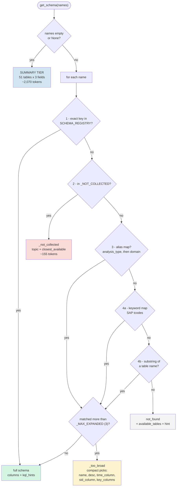
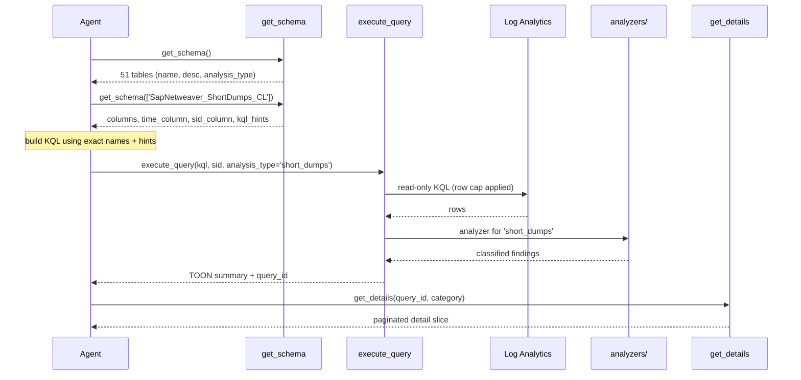

# `get_schema` — Tool Reference & Flow

**Source:** [tools/get_schema.py](../tools/get_schema.py)
**Registry:** [schema_registry.py](../schema_registry.py) → [schemas/](../schemas/)
**Last verified:** 2026-09-24 against `sapmon-laws-5aa047b6ade6a2` (prod AMS) and `sapmon-laws-d44c1e41d7949a` (CHA / HA-test)

---

## 1. Purpose

`get_schema` is the **first tool the agent must call**. Azure Log Analytics KQL is
case-sensitive and the AMS tables use inconsistent naming (`SID_s` vs `sapsid_s` vs
`sid_s`; `serverTimestamp_t` vs `TimeGenerated` vs `TimeGeneratedPrometheus_t`).
Without the schema, generated KQL either errors out or — worse — silently returns
zero rows.

The tool answers three questions:

1. **Which table** holds the data for this question?
2. **What are the exact column names** and types?
3. **How do I filter it correctly** (time column, SID column, casting rules)?

---

## 2. Registry at a glance

51 tables across 5 domains, all verified to exist in the live workspaces.

| Domain | Tables | Layer |
|---|---:|---|
| `sap_application` | 23 | NetWeaver |
| `hana_db` | 25 | HANA |
| `os_infrastructure` | 1 | OS (`Prometheus_OSExporter_CL`) |
| `ha_cluster` | 1 | HA (`Prometheus_HaClusterExporter_CL`) |
| `common` | 1 | `COMMON_VM_ArmId_Mapping_CL` |

Each schema entry carries:

```python
{
  "table_name":    "SapHana_BlockedTransactions_CL",
  "domain":        "hana_db",            # layer grouping
  "description":   "...",                 # first sentence used in the summary tier
  "data_source":   "SAP Monitor HANA provider — M_BLOCKED_TRANSACTIONS",
  "time_column":   "TimeGenerated",       # what to filter time on
  "sid_column":    "sapsid_s",            # what to filter SID on
  "analysis_type": "hana_db",             # routes to an analyzer in analyzers/
  "key_columns":   [...],                 # the few columns that matter most
  "columns":       { "<name>": {"type": ..., "description": ...}, ... },
  "kql_hints":     [ "...", ... ],        # gotchas, casts, correlation advice
}
```

---

## 3. Two call shapes

### 3.1 Discovery — `get_schema()`

Returns every registered table with three fields only.

```json
{
  "registered_tables": [
    { "name": "SapHana_Alerts_CL",
      "description": "SAP HANA internal alert log.",
      "analysis_type": "hana_db" }
  ],
  "total_tables": 51,
  "global_kql_rules": [ "Column names are CASE-SENSITIVE. ..." ],
  "hint": "Call get_schema(['TableName']) to get full column list, ..."
}
```

**Cost: ~2,070 tokens.** Deliberately omits `columns`, `kql_hints`, `time_column`
and `sid_column` — those would multiply the size with no benefit, because the agent
still has to fetch the full schema before it can write KQL.

### 3.2 Detail — `get_schema(['<name>', ...])`

Accepts **four kinds of input**, all resolved by the same pipeline:

| Input kind | Example | Resolves to |
|---|---|---|
| Exact table name | `SapHana_Alerts_CL` | that table |
| Analysis type | `short_dumps` | all tables with that `analysis_type` |
| Domain name | `hana_db`, `os_infrastructure` | all tables in that domain |
| SAP transaction code | `SM21`, `ST03N`, `DB12` | mapped table |

---

## 4. Resolution flow



### Why this order

- **`_NOT_COLLECTED` is checked before fuzzy matching.** Otherwise a code like
  `SM04` could substring-match an unrelated table and the agent would confidently
  query the wrong data.
- **`analysis_type` outranks `domain`.** The alias map is built from analysis types
  first; domains then fill only the keys still free:

  ```python
  for dom, tabs in _domain_map.items():
      _alias_map.setdefault(dom, tabs)   # setdefault => analysis_type wins
  ```

  Only `hana_db` and `ha_cluster` are both, and both resolve to identical table
  lists, so precedence has no effect today. It becomes load-bearing when
  `hana_db` is split into several analysis types — the domain entry keeps the
  name working automatically.

---

## 5. The `_MAX_EXPANDED` guard

An analysis_type or domain can map to many tables. Returning all of them as full
schemas is a token disaster.

```python
_MAX_EXPANDED = 3
```

Above that count, the response switches to **compact picks** — enough to choose a
table, not enough to write KQL:

```json
{ "_too_broad": { "hana_db": {
    "matched_tables": 25,
    "candidates": [
      { "name": "SapHana_Alerts_CL",
        "description": "SAP HANA internal alert log.",
        "time_column": "TimeGenerated",
        "sid_column": "sapsid_s",
        "key_columns": ["ALERT_ID_s", "RATING_s", "ALERT_DETAILS_s", "RECOMMENDATION_s"] }
    ],
    "hint": "'hana_db' matches 25 tables. ... call get_schema(['ExactTableName', ...]) again."
}}}
```

| `get_schema(['hana_db'])` | Bytes | Tokens |
|---|---:|---:|
| Without guard (25 full schemas) | 80,047 | **20,011** |
| With guard (25 compact picks) | 7,214 | **1,803** |
| | | **91% saved** |

> **This is a recovery path, not a step in the normal flow.** The happy path is
> two calls: `get_schema()` → pick a table from the descriptions →
> `get_schema(['ExactName'])`. The guard only fires when the agent passes a group
> name instead of a table name, and makes that mistake cheap rather than ruinous.

Current alias groups and whether they trip the guard:

| Alias | Tables | Full cost | Guard |
|---|---:|---:|---|
| `hana_db` (domain + type) | 25 | 20,011 tok | fires |
| `sap_application` (domain) | 23 | — | fires |
| `workload_statistics` | 5 | 8,796 tok | fires |
| `queue_monitoring` | 3 | 2,038 tok | no |
| `short_dumps` | 2 | 2,685 tok | no |
| `transport_management` | 2 | 1,535 tok | no |

---

## 6. Transaction-code resolution

Two mechanisms, deliberately kept separate.

### Substring match — zero maintenance

Any name overlapping a table name resolves automatically. **No map entry needed:**

```text
savepoint                → SapHana_IO_Savepoint_CL
BlockedTransactions      → SapHana_BlockedTransactions_CL
InternodeSendThroughput  → SapHana_InternodeSendThroughput_CL
SWNC_Transaction         → SapNetweaver_SWNC_Transaction_CL
EnqueueRead              → SapNetweaver_EnqueueRead_CL
```

### `_keyword_map` — only for codes that share no substring

`SM21` has nothing in common with `SapNetweaver_SysLogs_CL`, so it must be mapped
explicitly. This is the **only** reason the map exists; it does not need to grow as
tables are added.

| Code | Table |
|---|---|
| `SM21`, `syslog` | `SapNetweaver_SysLogs_CL` |
| `ST22`, `shortdump` | `SapNetweaver_ShortDumps_CL` |
| `SM37`, `SM36` | `SapNetweaver_BatchJobs_CL` |
| `SM13` | `SapNetweaver_FailedUpdates_CL` |
| `SM50`, `SM66` | `SapNetweaver_ABAPGetWPTable_CL` |
| `SM51` | `SapNetweaver_GetSystemInstanceList_CL` |
| `SM58`, `trfc` | `SapNetweaver_TransactionalRfc_CL` |
| `SMQ1` / `SMQ2` | `Outbound` / `InboundQueues_CL` |
| `SM12` | `SapNetweaver_EnqueueRead_CL` |
| `ST03`, `ST03N` | `SapNetweaver_SWNC_CL` |
| `/SDF/MON` | `SapNetweaver_SMON_CL` |
| `ST06`, `OS07` | `Prometheus_OSExporter_CL` |
| `DB12`, `DB13` | `SapHana_BackupCatalog_CL` |
| `DB02` | `SapHana_size01_CL` |
| `ST04` | `SapHana_LoadHistory_CL` |
| `DBACOCKPIT` | `SapHana_SystemOverview_CL` |

Coverage: **23 of 28** common codes resolve.

---

## 7. `_NOT_COLLECTED` — answering "no" properly

The remaining 5 codes are not gaps in the map — AMS genuinely does not collect that
data. Returning a generic `not_found` made the agent scan 51 table names looking for
something that cannot exist. Now it gets a definitive answer plus the nearest
substitute:

```json
{ "_not_collected": { "STAD": {
    "topic": "individual statistical records (per dialog step)",
    "collected_by_ams": false,
    "hint": "'STAD' ... is NOT collected by AMS — no table exists. Do not search available_tables for it.",
    "closest_available": "SapNetweaver_SWNC_Transaction_CL — same data aggregated per transaction per interval"
}}}
```

| Transaction | Topic | Closest available |
|---|---|---|
| `ST02` | buffer / shared-memory statistics | `SWNC_Memory_CL` (per-program only, no hit ratios) |
| `ST05` | SQL / RFC / enqueue trace | `SWNC_Transaction_CL` aggregated DB time |
| `STAD` | individual statistical records | `SWNC_Transaction_CL` (aggregated equivalent) |
| `AL08`, `SM04` | live user sessions | `SWNC_User_CL` (workload, not live sessions) |
| `SM59` | RFC destination configuration | `TransactionalRfc_CL` (tRFC errors by destination) |
| `ST12`, `SE30`, `SAT` | ABAP trace / runtime analysis | — |
| `SMICM` | ICM / web dispatcher monitor | — |
| `RZ20` | CCMS alert monitor | — |
| `SM35` | batch input sessions | — |
| `SP01` | spool requests | — |
| `ST07` | application monitor | — |

`ST02`: **537 → 155 tokens**, and the agent stops instead of guessing.

---

## 8. Response cost reference

| Call | Tokens |
|---|---:|
| `get_schema()` — all 51 tables | 2,070 |
| `get_schema(['SapHana_Alerts_CL'])` | 689 |
| `get_schema(['SapHana_BlockedTransactions_CL'])` | 1,128 |
| `get_schema(['SapNetweaver_ShortDumps_CL'])` | 1,366 |
| `get_schema(['Prometheus_OSExporter_CL'])` | 1,741 |
| `get_schema(['SapNetweaver_SWNC_Transaction_CL'])` | 2,183 |
| `get_schema(['hana_db'])` — guard fires | 1,803 |
| `get_schema(['ST02'])` — not collected | 155 |
| `get_schema(['zzz'])` — not found | 536 |

Enrichment of the summary tier was evaluated and **rejected** — it costs tokens on
every call without removing the second call, because column names are always needed:

| Summary variant | Tokens | Removes a call? |
|---|---:|---|
| Current (name / desc / type) | 2,070 | — |
| `+ time_column, sid_column` | 2,816 | No |
| `+ time, sid, key_columns` | 4,057 | No |

---

## 9. Where `get_schema` sits in the RCA workflow



`analysis_type` is the join between the two tools: the value in the schema is the
value passed to `execute_query`, which routes to the matching analyzer in
[analyzers/](../analyzers/). Tables whose `analysis_type` has no registered analyzer
fall through to the generic summarizer.

**Currently unmapped** (fall through to generic summarizer):

| analysis_type | Tables |
|---|---|
| `hana_db` | all 25 HANA tables |
| `enqueue_locks` | `SapNetweaver_EnqueueRead_CL` |
| `enqueue_statistics` | `SapNetweaver_EnqGetStatistic_CL` |

---

## 10. Extending

**Add a table** — add an entry to the relevant file in [schemas/](../schemas/).
It is picked up automatically: it appears in the summary, becomes resolvable by
exact name, joins its `analysis_type` and `domain` alias groups, and gains substring
matching. No other file changes.

**Add an analyzer** — create `analyzers/<domain>.py` with a function decorated
`@register("<analysis_type>")`. The analyzer registry is the single source of truth;
nothing needs listing in [schema_registry.py](../schema_registry.py).

**Add a transaction code** — only needed when the code shares no substring with the
table name. Add to `_keyword_map`, or to `_NOT_COLLECTED` if AMS does not collect it.

---

## 11. Known gaps

- `workload_statistics` now spans 5 tables (after the SWNC sub-tables were added) so
  it trips the guard, costing an extra round-trip where it used to return one schema
  directly. The fix is splitting the analysis_type — deferred to the analyzer work.
- Schema compaction is partial: `ShortDumps_SNAPFulldump_CL` (342 bytes/column) and
  `GetSystemInstanceList_CL` (244) are still above the ~140 norm. Low impact, since
  every per-call response is already under ~2.2K tokens.
- The two Prometheus tables are 742 and 668 bytes/column because they embed the full
  metric catalogue in the `name_s` description. That is judged worth the cost — the
  catalogue is what lets the agent pick the right metric.
